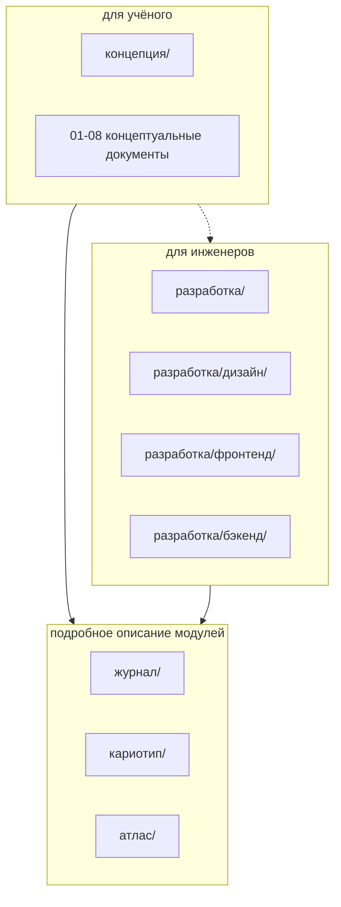

# Документация Karyolab v2

Это граф знаний по проекту Karyolab v2. Документация поделена на **два больших блока**:

- [`концепция/`](концепция/README.md) — для учёного-заказчика. Простыми словами: что программа делает, какими понятиями оперирует, какая логика стоит за интерфейсом.
- [`разработка/`](разработка/README.md) — для инженеров. Технические решения: дизайн, фронтенд, бэкенд, инфраструктура.

Кроме этих двух блоков, есть **подробные модульные документы**, на которые ссылаются и концепция, и разработка:

- [`журнал/`](журнал/README.md) — детальное описание раздела журнала.
- [`кариотип/`](кариотип/README.md) — детальное описание раздела кариотипа.
- [`атлас/`](атлас/README.md) — детальное описание атласа.

И отдельно:

- [`контекстные файлы/`](контекстные%20файлы/) — материалы заказчика (анкеты, правки, переписка), на основе которых ведётся работа.

## Куда Идти С Чем

| Что Вам Нужно | Куда Идти |
|---|---|
| Понять, зачем нужна программа в целом | [концепция/01_общая_концепция.md](концепция/01_общая_концепция.md) |
| Разобраться в терминах "образец", "метафаза", "кариотип образца" | [концепция/02_данные_и_иерархия.md](концепция/02_данные_и_иерархия.md), [концепция/07_термины_и_словарь.md](концепция/07_термины_и_словарь.md) |
| Понять, как работает журнал | [концепция/03_журнал_концепция.md](концепция/03_журнал_концепция.md) |
| Понять, как работает кариотип | [концепция/04_кариотип_концепция.md](концепция/04_кариотип_концепция.md) |
| Понять, как работает атлас | [концепция/05_атлас_концепция.md](концепция/05_атлас_концепция.md) |
| Понять логику аномалий | [концепция/06_аномалии_и_замещения.md](концепция/06_аномалии_и_замещения.md) |
| Понять, как работает оператор изо дня в день | [концепция/08_рабочие_сценарии.md](концепция/08_рабочие_сценарии.md) |
| Найти подробное описание конкретного экрана | модульные папки: [журнал/](журнал/README.md), [кариотип/](кариотип/README.md), [атлас/](атлас/README.md) |
| Начать писать бэкенд | [разработка/бэкенд/README.md](разработка/бэкенд/README.md) |
| Уточнить контракт API | [разработка/бэкенд/03_api.md](разработка/бэкенд/03_api.md) |
| Уточнить модель данных | [разработка/бэкенд/02_модель_данных.md](разработка/бэкенд/02_модель_данных.md) |
| Сверить дизайн UI | [разработка/дизайн/README.md](разработка/дизайн/README.md) |

## Иерархия Знаний

Концепция — **источник правды** по продуктовым решениям. Если в разработке и в концепции что-то расходится — обновляем разработку.

Модульные папки (`журнал/`, `кариотип/`, `атлас/`) — это подробное "как именно" по каждому экрану и правилу. Они расширяют концепцию и одновременно служат входными данными для разработки.

## Приоритеты Текущего Этапа

1. **Журнал и Кариотип** — основной фокус. Документация для них приведена к актуальной концепции.
2. **Атлас** — частично доработан (добавлены: два уровня аномалий, синонимия "эталонный"="теоретический", объект сохранённого сравнения, объединённое понятие "класс+субгеном"). Полная доработка отложена.
3. **Бэкенд** — спроектирован "на бумаге", код ещё не написан. Документация задаёт направление.
4. **Фронтенд** — на текущем этапе **не трогаем**. Документация описывает существующее состояние и контракты на будущее.

## Контекстные Файлы

В папке [`контекстные файлы/`](контекстные%20файлы/) лежат материалы от заказчика, в порядке приоритета:

1. `0 анкета2 вопросы.md` — самые свежие развёрнутые ответы на анкету;
2. `1 правки документация.md` — правки по предыдущей версии документации;
3. `2 полуслоповое черновое тз отредактированное мной лично..md` — общая концепция и ТЗ;
4. `3 кариолаб в2.md` — старые правки первой версии (большинство уже учтено).

При расхождениях **истина в более актуальном файле** (меньший номер).

## Если Что-То Кажется Неправильным

Это нормально. Документация эволюционирует вместе с пониманием продукта.

- Если правило в концепции выглядит странно — стоит обсудить с заказчиком и поправить.
- Если правило в модульном описании расходится с концепцией — поправить модульное описание.
- Если правило в разработке расходится с обоими — поправить разработку.

Не оставляйте противоречия в надежде, что они "сами решатся". Они не решатся.
