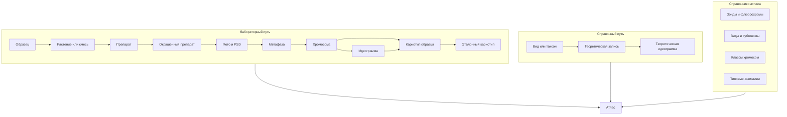

# Объекты И Источники Данных

Атлас работает не со своими собственными лабораторными объектами, а с уже существующими данными из кариотипа и журнала плюс собственными справочниками и теоретическими записями. Поэтому важно явно описать, какие объекты он использует и откуда они приходят.

## Объекты Атласа

Атлас опирается на следующие объекты:

- `хромосома` - отдельный объект, извлеченный из метафазы (см. [../кариотип/02_объекты_и_происхождение_данных.md](../кариотип/02_объекты_и_происхождение_данных.md));
- `идеограмма` - схема хромосомы с центромерой, сигналами и аномалиями (см. [../кариотип/05_идеограммы_и_сигналы.md](../кариотип/05_идеограммы_и_сигналы.md));
- `кариотип образца` - лицевой результат, собранный в кариотипе (см. [../кариотип/08_лицевой_кариотип_образца.md](../кариотип/08_лицевой_кариотип_образца.md));
- `эталонный кариотип` - тот же `кариотип образца`, но помеченный эталонным;
- `теоретическая запись` - литературная или справочная запись без полной лабораторной цепочки;
- `образец` - якорь происхождения, ведется в журнале;
- справочники: `виды`, `субгеномы`, `зонды`, `флюорохромы`, `классы хромосом`, `типовые аномалии`.

Атлас не создает свои хромосомы и идеограммы. Если эксперт хочет добавить новую теоретическую идеограмму, она создается как часть теоретической записи, а не как отдельная "хромосома атласа".

## Два Источника Данных

В атласе уживаются два потока данных, и их нельзя смешивать.

### Лабораторный Путь

Все хромосомы и идеограммы реальных образцов приходят в атлас по полной цепочке происхождения, описанной в журнале и кариотипе:

`образец -> растение или смесь растений -> препарат -> окрашенный препарат -> фото или PSD -> метафаза -> хромосома -> идеограмма -> кариотип образца`.

Каждая такая хромосома в атласе должна знать свой источник: метафазу, окрашенный препарат, набор зондов, образец и его лабораторную историю. Из любой ячейки атласа должен быть переход обратно к этой исходной хромосоме и кариотипу образца.

### Справочный Путь

Теоретические и литературные записи приходят в атлас по короткому пути, описанному в [../журнал/10_связь_с_кариотипом_и_атласом.md](../журнал/10_связь_с_кариотипом_и_атласом.md):

`образец или таксон -> теоретическая запись атласа -> теоретическая идеограмма`.

Такая запись:

- не требует растения, препарата, окраски и фото;
- не создает лабораторных ивентов;
- не попадает в прогресс журнала;
- явно помечается как `теоретическая запись`;
- может использоваться в сравнениях, но не считается доказательным результатом.

Подробнее это описано в [07_теоретические_данные.md](07_теоретические_данные.md).

## Справочники Атласа

Справочники - это внутренняя память программы о биологических объектах:

- `виды` и их типовые наборы субгеномов (см. [04_виды_и_субгеномы.md](04_виды_и_субгеномы.md));
- `субгеномы` (там же);
- `зонды` и `флюорохромы` с привязкой канала (см. [03_зонды_и_флюорохромы.md](03_зонды_и_флюорохромы.md));
- `классы хромосом` и `типовые аномалии` (см. [05_классы_хромосом_и_аномалии.md](05_классы_хромосом_и_аномалии.md)).

Справочники живут в атласе, потому что:

- они настраиваются редко, но используются постоянно;
- ими пользуются и журнал (зонды в гибридизации), и кариотип (классы, субгеномы, аномалии);
- держать их в каждом разделе по копии было бы небезопасно для целостности данных.

## Откуда Атлас Берет Данные

В таблице ниже зафиксировано, откуда приходит каждый объект атласа.

| Объект в атласе | Источник | Где создается | Где редактируется |
|---|---|---|---|
| Хромосома | реальный кариотип | импорт PSD в кариотипе | в кариотипе, разметка хромосом |
| Идеограмма | реальный кариотип | разметка хромосом в кариотипе | в кариотипе |
| Кариотип образца | реальный кариотип | разметка генома и сборка лицевого кариотипа | в кариотипе |
| Эталон | реальный кариотип | пометка эталонным в кариотипе | флаг ставится из карточки кариотипа или из атласа |
| Теоретическая запись | атлас | в атласе | в атласе |
| Зонд, флюорохром | атлас | справочник в атласе | в атласе |
| Вид, субгеном | атлас | справочник в атласе | в атласе |
| Класс, типовая аномалия | атлас | справочник в атласе | в атласе |
| Образец | журнал | в журнале вручную | в журнале |
| Метафаза, окрашенный препарат | журнал и кариотип | в кариотипе и журнале | в кариотипе и журнале |

Атлас не должен сам создавать дубликаты этих объектов. Если в атласе видно поле, которое выглядит как дубль данных кариотипа или журнала, это ошибка модели данных.

## Происхождение Хромосомы В Атласе

Для каждой реальной хромосомы в атласе должен быть виден или доступен по клику минимум:

- образец и вид;
- метафаза и окрашенный препарат;
- набор зондов и каналы;
- кариотип образца, в который она вошла;
- класс и субгеном;
- список аномалий, если они отмечены.

Если эти данные не доступны, ячейку нельзя считать настоящим лабораторным результатом. Скорее всего это ошибка миграции или импорта.

## Происхождение Теоретической Записи

Для теоретической записи минимальный набор полей:

- вид или таксон;
- название записи;
- источник: литература, гипотеза, рабочая заметка эксперта;
- описание;
- идеограмма, если она нарисована;
- явная пометка `теоретическая запись`.

Теоретическая запись не должна притворяться кариотипом образца. В сетках и сравнениях ее всегда видно как теоретическую.

## Связанные Документы

- [[README|README атласа]] / [README.md](README.md)
- [[03_зонды_и_флюорохромы]] / [03_зонды_и_флюорохромы.md](03_зонды_и_флюорохромы.md)
- [[04_виды_и_субгеномы]] / [04_виды_и_субгеномы.md](04_виды_и_субгеномы.md)
- [[05_классы_хромосом_и_аномалии]] / [05_классы_хромосом_и_аномалии.md](05_классы_хромосом_и_аномалии.md)
- [[06_эталонные_кариотипы]] / [06_эталонные_кариотипы.md](06_эталонные_кариотипы.md)
- [[07_теоретические_данные]] / [07_теоретические_данные.md](07_теоретические_данные.md)
- [[12_границы_с_журналом_и_кариотипом]] / [12_границы_с_журналом_и_кариотипом.md](12_границы_с_журналом_и_кариотипом.md)
- [[кариотип/02_объекты_и_происхождение_данных|объекты кариотипа]] / [../кариотип/02_объекты_и_происхождение_данных.md](../кариотип/02_объекты_и_происхождение_данных.md)
- [[журнал/02_объекты_и_связи|объекты журнала]] / [../журнал/02_объекты_и_связи.md](../журнал/02_объекты_и_связи.md)
