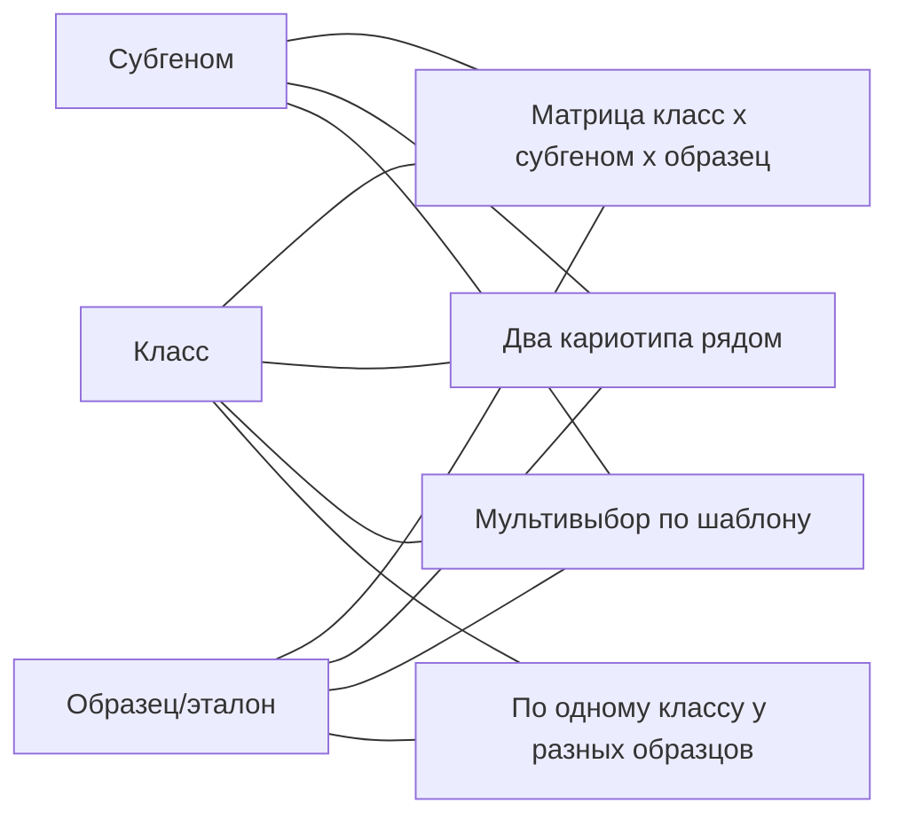

# Сетки И Сравнения

Главное, что атлас умеет делать визуально, - это разные раскладки уже размеченных хромосом. Без раскладок атлас превращается в просто список картинок. Поэтому в разделе нужно несколько типовых сеток.

Эти раскладки опираются на два готовых паттерна фронтенда: матрица из `frontend/src/components/karyotype/genome/GenomeMatrix.tsx` (тёмный холст, шапка субгеномов, ячейки со страницами хромосом) и пикеры выбора из `frontend/src/components/karyotype/export/ExportSamplePicker.tsx` (светлая панель, поиск, чекбоксы). Атлас собирает из них исследовательский экран.

## Базовая Идея

Любая раскладка атласа строится из трёх осей:

- `класс хромосомы` (`1A`, `5D`, `1RS.1BL`...);
- `субгеном` (`A`, `B`, `D`, `R`, ...);
- `образец или эталон` (источник кариотипа).

В разных режимах одна из этих осей становится горизонтальной, другая вертикальной, а третья сворачивается в фильтр.

## Матрица Класс x Субгеном x Образец

Главная раскладка. Базовая форма - такая же, как в разметке генома кариотипа:

- столбцы - субгеномы;
- строки - классы хромосом;
- в ячейках - хромосомы.

В отличие от кариотипа, в атласе ячейка содержит хромосомы не одного образца, а нескольких:

- из выбранных образцов и эталонов;
- из текущей панели зондов;
- с текущим фильтром по виду, аномалии, режиму отображения.

Внутри ячейки хромосомы группируются:

- сначала эталоны;
- затем образцы в порядке выбора;
- внутри одного образца - все подходящие хромосомы (например `5D-1`, `5D-2` из разных метафаз).

Это даёт визуальный ответ: "как класс `5D` выглядит у выбранных образцов на фоне эталона".

Если выбран один образец, матрица превращается в обычную картину кариотипа этого образца. Если выбрано много образцов, та же матрица превращается в исследовательский холст.

## Два Кариотипа Рядом

Раскладка `два кариотипа рядом` нужна для прямого сравнения двух кариотипов.

В ней:

- слева пикер `Кариотип A`;
- справа пикер `Кариотип B`;
- в центре две одинаковые матрицы класс x субгеном бок о бок;
- одинаковые классы расположены на одной горизонтальной линии;
- режим отображения общий для обеих сторон;
- выравнивание по центромере включено по умолчанию.

Это закрывает типовые задачи: "образец vs эталон", "образец vs родитель", "две метафазы одного образца", "одна гибридизация vs другая гибридизация".

В пикерах должны быть отдельные группы: `образцы`, `эталоны`, `теоретические записи` (как у `ExportSamplePicker.tsx` группы `recent` и `filtered`).

## Мультивыбор По Шаблону

Раскладка `мультивыбор` - аналог шаблона `multi_select` из экспорта (см. `ExportTemplateType` во `frontend/src/lib/types.ts`):

- выбирается несколько образцов или эталонов (от двух до многих);
- их кариотипы выкладываются в одну общую матрицу;
- в каждой строке класса видны соответствующие хромосомы каждого выбранного образца;
- субгеномы делят матрицу на группы.

Эта раскладка нужна, когда сравниваются больше двух образцов и нужно увидеть всю выборку сразу.

## Сравнение По Субгеному У Разных Образцов

Иногда нужно сравнить не весь кариотип, а только один субгеном у нескольких образцов:

- "как выглядит весь `D`-субгеном у моих образцов `T.aestivum`";
- "как выглядит `R`-субгеном у тритикале и у чистой ржи".

Эта раскладка строится так:

- столбцы - выбранные образцы;
- строки - классы фиксированного субгенома (`1`, `2`, ...`7` для пшениц);
- субгеном выбирается один.

## Сравнение По Препарату И По Зонду

Близкие, но отдельные раскладки:

- `один образец, разные препараты` - один и тот же образец, но кариотипы получены из разных физических препаратов или разных растений. Помогает увидеть техническую вариативность;
- `один образец, разные зонды` - один образец, но разные наборы зондов в разных гибридизациях. Помогает увидеть, как меняется видимая картина в зависимости от панели.

В обеих раскладках столбцы - это варианты препарата или гибридизации, строки - классы хромосом.

## Сценарные Раскладки

Несколько готовых сценарных раскладок, которые удобно вызывать одной кнопкой:

- `образец vs эталон` - выбран образец и эталон того же вида, открывается раскладка `два кариотипа рядом`;
- `образец vs родители` - открывается мультивыбор с выбранным образцом и его матерью/отцом из журнала;
- `сиблинги одного скрещивания` - открывается мультивыбор с образцами одного года и одних родителей;
- `все по одному классу` - открывается раскладка "по классу у разных образцов" с фиксированным классом.

Эти сценарные раскладки описаны подробнее в [11_сценарии_исследования.md](11_сценарии_исследования.md).

## Группировка И Порядок Внутри Ячейки

В одной ячейке матрицы может оказаться много хромосом. Для читаемости нужны простые правила группировки:

- сначала эталоны и теоретические записи (визуально отделены);
- потом образцы в выбранном пользователем порядке (или в порядке ID);
- внутри одного образца - все подходящие хромосомы из всех выбранных метафаз;
- если выбран фильтр по препарату или зонду, в группу попадают только подходящие.

Если хромосом в ячейке слишком много, в матрице видно сжатое представление со счётчиком (`5D - 12 хромосом`), и развёрнутая ячейка открывается отдельной панелью или модальным окном.

## Источник Каждой Ячейки

Любая хромосома в любой раскладке должна знать своё происхождение и давать переход обратно:

- к исходной хромосоме в кариотипе;
- к идеограмме;
- к метафазе и окрашенному препарату;
- к кариотипу образца;
- к карточке образца в журнале;
- к карточке зонда (если хромосома попала по фильтру зонда).

Это закрывает правило "атлас не существует в вакууме": из любой ячейки можно вернуться к исходным данным.

## Связанные Документы

- [[README|README атласа]] / [README.md](README.md)
- [[02_объекты_и_источники_данных]] / [02_объекты_и_источники_данных.md](02_объекты_и_источники_данных.md)
- [[06_эталонные_кариотипы]] / [06_эталонные_кариотипы.md](06_эталонные_кариотипы.md)
- [[08_режимы_отображения]] / [08_режимы_отображения.md](08_режимы_отображения.md)
- [[10_фильтры_и_поиск]] / [10_фильтры_и_поиск.md](10_фильтры_и_поиск.md)
- [[11_сценарии_исследования]] / [11_сценарии_исследования.md](11_сценарии_исследования.md)
- [[13_дизайн_атласа]] / [13_дизайн_атласа.md](13_дизайн_атласа.md)
- [[кариотип/06_разметка_генома|разметка генома]] / [../кариотип/06_разметка_генома.md](../кариотип/06_разметка_генома.md)
- [[кариотип/09_экспорт_и_шаблоны_обзоров|шаблоны экспорта]] / [../кариотип/09_экспорт_и_шаблоны_обзоров.md](../кариотип/09_экспорт_и_шаблоны_обзоров.md)
