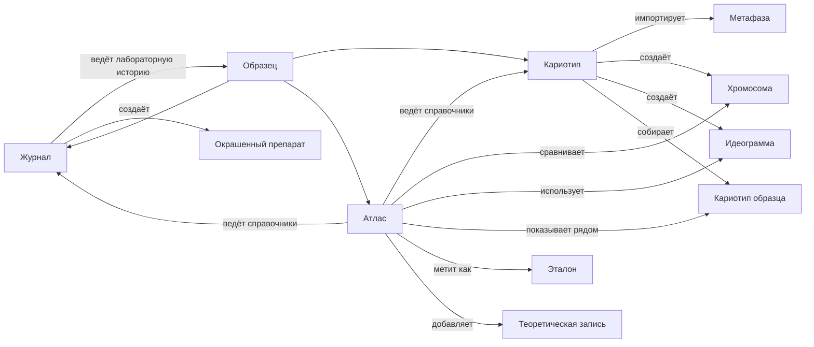

# Границы С Журналом И Кариотипом

Атлас работает с теми же данными, что журнал и кариотип, но отвечает на свой класс вопросов. Этот документ - зеркальная пара к [../кариотип/12_границы_с_журналом_и_атласом.md](../кариотип/12_границы_с_журналом_и_атласом.md) и [../журнал/10_связь_с_кариотипом_и_атласом.md](../журнал/10_связь_с_кариотипом_и_атласом.md). Везде должна быть одна и та же картина.

- `Журнал` отвечает на вопрос: что физически происходило с материалом.
- `Кариотип` отвечает на вопрос: что получилось на снимках и как собран результат.
- `Атлас` отвечает на вопрос: что эти результаты значат в сравнении с другими образцами, эталонами и литературой.

## Граф Границ

## Что Делает Атлас

Атлас:

- ведёт справочники видов, субгеномов, зондов, флюорохромов, классов хромосом и типовых аномалий;
- хранит флаг "эталонный" у кариотипов образцов и список избранного эталонов;
- хранит теоретические записи и теоретические идеограммы;
- собирает и показывает раскладки уже размеченных хромосом;
- предоставляет фильтры и поиск по накопленным данным;
- даёт переходы из любой ячейки обратно к исходной хромосоме, кариотипу и образцу;
- запоминает пользовательские пресеты фильтров и режимов отображения;
- согласует режимы отображения с экспортом из кариотипа.

## Что Делает Кариотип

Кариотип отвечает за то, чем атлас никогда не занимается:

- импорт PSD и фото;
- извлечение хромосом;
- создание метафаз;
- разметка хромосом;
- создание идеограмм;
- разметка генома;
- выбор лучших хромосом;
- сборка лицевого кариотипа образца;
- экспорт обзорных изображений и рабочих таблиц.

Когда в кариотипе появляется утверждённый результат, он становится виден атласу. Но создание и редактирование этого результата остаются в кариотипе.

## Что Делает Журнал

Журнал отвечает за лабораторную историю:

- создание образцов, растений, препаратов и окрашенных препаратов;
- ведение событий лабораторной работы;
- статусы и места хранения;
- факт фотографирования;
- ссылки на результаты кариотипа.

Атлас не подменяет журнал. Если у образца нет лабораторных кариотипов, атлас просто ничего по нему не покажет, кроме теоретических записей, если они добавлены вручную.

## Что Атлас НЕ Делает

Атлас сознательно не делает несколько вещей:

- не редактирует разметку хромосом;
- не редактирует идеограммы;
- не меняет состав лицевого кариотипа образца;
- не создаёт лабораторные ивенты;
- не меняет статусы образца, препарата, окрашенного препарата;
- не меняет статус кариотипа на `утверждён` за эксперта;
- не считает теоретические записи лабораторным результатом;
- не дублирует прогресс журнала и таблицы кариотипа.

Если в атласе хочется добавить что-то из этого списка, это сигнал, что фича на самом деле принадлежит другому разделу.

## Где Живут Справочники

Эта таблица закрепляет, какой раздел отвечает за какой справочник.

| Справочник | Где живёт | Кто использует |
|---|---|---|
| Виды | атлас | журнал (поле `species`), кариотип (шаблон субгеномов), атлас |
| Субгеномы | атлас | кариотип (`GenomeLayout.subgenomes`), атлас |
| Классы хромосом | атлас | кариотип (разметка), атлас |
| Зонды | атлас | журнал (`HybridizationEvent.probes`), кариотип (импорт PSD, разметка сигналов), атлас |
| Флюорохромы | атлас | журнал (через зонды), кариотип (через зонды), атлас |
| Типовые аномалии | атлас | кариотип (`AnomalyType`), атлас |
| Эталоны | атлас (через флаг у кариотипа образца) | атлас |
| Теоретические записи | атлас | атлас |
| Образцы | журнал | журнал, кариотип, атлас |
| Препараты, окрашенные препараты | журнал | журнал, кариотип, атлас |
| Хромосомы, идеограммы, кариотипы образцов | кариотип | кариотип, атлас |

Каждый справочник или объект имеет ровно одного хозяина. Все остальные разделы только читают.

## Переходы Между Разделами

Нужны прямые переходы:

- из карточки образца в журнале -> в атлас (фильтр по образцу или сценарий `сиблинги`);
- из таблицы аномалий в кариотипе -> в атлас (фильтр по типу аномалии и классу);
- из карточки кариотипа в кариотипе -> в атлас (раскладка `сравнение с эталоном`);
- из ячейки атласа -> назад к исходной хромосоме в кариотипе;
- из ячейки атласа -> к идеограмме в кариотипе;
- из карточки эталона в атласе -> к исходному кариотипу образца в кариотипе;
- из теоретической записи в атласе -> к карточке вида в журнале (если запись привязана к виду) или к карточке образца (если к образцу).

Переход должен сохранять контекст: после возврата эксперт не должен заново настраивать фильтры.

## Правило Несвоих Изменений

Самое важное правило для атласа: атлас не переписывает чужие данные.

- Если в атласе виден класс хромосомы - его поставил эксперт в кариотипе. Атлас не может его поменять.
- Если в атласе видно происхождение хромосомы - его построил журнал и кариотип. Атлас не может его перепривязать.
- Если в атласе видно, что окрашенный препарат сделан с зондом GAA - это записал журнал. Атлас не может изменить состав гибридизации.
- Если эксперт хочет изменить какой-то из этих фактов, он переходит в нужный раздел и правит данные там.

Эта дисциплина бережёт целостность лабораторной базы. Без неё легко получить ситуацию, когда в журнале одно, в кариотипе другое, а в атласе третье.

## Связанные Документы

- [[README|README атласа]] / [README.md](README.md)
- [[02_объекты_и_источники_данных]] / [02_объекты_и_источники_данных.md](02_объекты_и_источники_данных.md)
- [[06_эталонные_кариотипы]] / [06_эталонные_кариотипы.md](06_эталонные_кариотипы.md)
- [[07_теоретические_данные]] / [07_теоретические_данные.md](07_теоретические_данные.md)
- [[10_фильтры_и_поиск]] / [10_фильтры_и_поиск.md](10_фильтры_и_поиск.md)
- [[11_сценарии_исследования]] / [11_сценарии_исследования.md](11_сценарии_исследования.md)
- [[кариотип/12_границы_с_журналом_и_атласом|границы кариотипа]] / [../кариотип/12_границы_с_журналом_и_атласом.md](../кариотип/12_границы_с_журналом_и_атласом.md)
- [[журнал/10_связь_с_кариотипом_и_атласом|связь журнала]] / [../журнал/10_связь_с_кариотипом_и_атласом.md](../журнал/10_связь_с_кариотипом_и_атласом.md)
