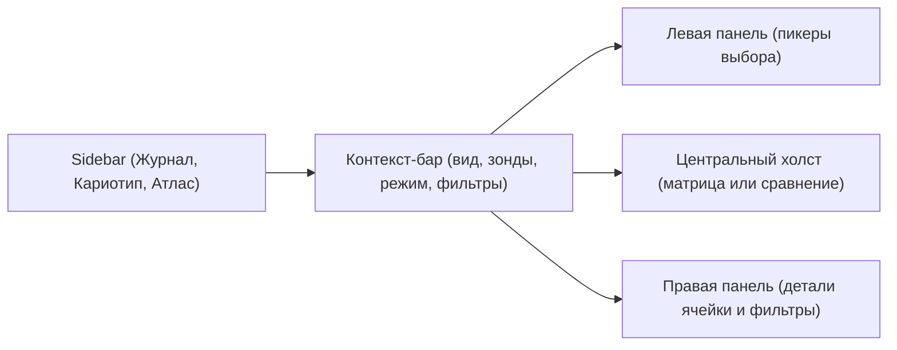

# Дизайн Атласа

Это единый дизайн-документ всего раздела `Атлас`. Он опирается на готовый фронтенд-код Karyolab v2, а не на скриншот. В исходниках уже есть подходящие паттерны: каркас `Sidebar.tsx` и маршрутов, `ChromosomeGlyph` для отрисовки хромосом, `GenomeMatrix` для тёмной матрицы, `ExportSamplePicker` для светлых пикеров выбора, `ExportTemplatePicker` для шаблонов сравнений. Атлас собирает из них рабочие экраны без новой стилевой системы.

## Навигация И Маршруты

В сайдбаре `Атлас` - пункт верхнего уровня, рядом с `Журнал` и раскрывающимся `Кариотип`. В `frontend/src/components/layout/Sidebar.tsx` он уже подключён как `NavLink to="/атлас"` с иконкой `Library` из `lucide-react`. Маршрут `/атлас` зарегистрирован в `frontend/src/routes.tsx`, сейчас под заглушкой `StubPage`.

В рабочей версии маршрут раскрывается в подэкраны:

- `/атлас/матрица` - матрица класс x субгеном x образец;
- `/атлас/сравнение` - два кариотипа рядом и мультивыбор;
- `/атлас/эталоны` - список эталонов и быстрый вход в сравнение;
- `/атлас/справочники` - зонды, флюорохромы, виды, субгеномы, классы, типовые аномалии, теоретические записи.

В сайдбаре `Атлас` раскрывается так же, как `Кариотип`: chevron, подсписок ссылок с иконками. Это сохраняет единый паттерн навигации.

## Общий Каркас Экрана

У каждого экрана атласа одна и та же общая структура.

`Контекст-бар` - тонкая шапка под верхней навигацией, в стиле существующих карточек (фон `bg-white`, бордер `border-brand-line`). В ней живут: переключатель раскладки (`Матрица`, `Сравнение`, `Мультивыбор`), глобальный режим отображения (`только хромосома` / `+идеограмма` / `только идеограмма`), переключатель `выравнивать по центромере`, индикатор текущих фильтров.

`Левая панель` - светлый фон `white` с границами `border-brand-line`, как в `ExportSamplePicker.tsx`. Содержит пикеры: `Образцы`, `Эталоны`, `Зонды`, `Виды`. Каждый пикер - тот же паттерн: заголовок, поиск, группа `recent`/`избранное`, прокручиваемый список с чекбоксами.

`Центральный холст` - тёмный фон `bg-slate-950` с округлой рамкой `rounded-2xl border border-slate-700 p-4`, как в `GenomeMatrix.tsx`. Это рабочая поверхность атласа.

`Правая панель` - светлая, как левая. Содержит детали выбранной ячейки или хромосомы, фильтры, кнопку "найти похожее". В режиме сравнения двух кариотипов правая панель может скрываться, если нужно больше места под центральный холст.

## Матрица Атласа

Матрица атласа визуально совпадает с матрицей `GenomeMatrix.tsx`, но содержит данные нескольких источников.

- Тёмный фон `bg-slate-950`.
- Шапка субгеномов: горизонтальный ряд тёмных капсул `bg-slate-900` с белой буквой субгенома (`A`, `B`, `D`, `R`...). Кнопка `+ Добавить субгеном` в правом верхнем углу - акцентная капсула в стиле `border-brand-accent/40 bg-brand-accent/15`.
- Колонка номеров классов слева: маленькие подписи `text-slate-400`.
- Ячейки: рамка `border-slate-700`, фон `bg-slate-900`, для пустых - `border-dashed border-slate-700 bg-slate-900/60`. Состояния:
  - `пусто` - подпись `text-slate-600`;
  - `выбрано` - рамка `border-brand-accent`, фон `bg-brand-accent/10`;
  - `моносомия?` - тонкое кольцо `ring-amber-400/40` и бейдж `моносомия?` в углу;
  - `норма` - кольцо `ring-emerald-400/30`;
  - `трисомия?` - кольцо и бейдж `bg-amber-500/20 text-amber-300`.

В каждой ячейке хромосомы сгруппированы:

- сначала эталоны (со светлой обводкой `ring-1 ring-brand-accent/40`);
- затем образцы в порядке выбора;
- внутри образца - его хромосомы, отсортированные по метафазе и порядковому номеру;
- если хромосом в ячейке слишком много, видно сжатое представление со счётчиком `5D - 12 хр.`.

Каждая хромосома рендерится через тот же `ChromosomeGlyph` с флагом `dark`. Под глифом - подпись маленьким моноширинным шрифтом: `S-1730.25 / m1.c03`. Подпись скрывается, если включён режим максимально плотной матрицы.

## Экран Сравнения Двух Кариотипов

Экран `Сравнение` имеет двухколоночную раскладку.

- Левая половина центрального холста - кариотип A. В шапке - имя кариотипа, кнопка `сменить`, индикатор `эталон` или `теоретическая запись` если применимо.
- Правая половина - кариотип B, симметрично.
- Между половинами - тонкая вертикальная линия `border-slate-700`.
- Классы выровнены по горизонтальной сетке: одна и та же строка `5D` слева и справа - на одной высоте.
- Под обеими половинами - общие кнопки: `выровнять по центромере`, `режим отображения`, `показать аномалии`.

Если выбрана раскладка `мультивыбор`, центральный холст превращается в одну широкую матрицу класс x (субгеном x образец), где каждая колонка - сочетание `субгеном x образец`.

## Карточки Справочников

Карточки справочников живут на светлом фоне в стиле существующих форм журнала. Используется уже знакомая палитра: `bg-white`, `border-brand-line`, `text-brand-deep`, акценты `bg-brand-cream`, `bg-brand-mint`.

### Карточка Зонда

Поля:

- `название` - крупное;
- `мишень` или целевая последовательность;
- `производитель`;
- `флюорохром` - селект из справочника, с подсказкой выбранного канала (бейдж `red`/`green`/`blue` в подходящем цвете);
- `канал` - readonly, заполняется автоматически;
- `заметка`;
- список окрашенных препаратов и образцов, где зонд использовался;
- кнопка `показать в матрице атласа`.

### Карточка Флюорохрома

Поля: `название`, `канал`, `описание`, список зондов на этом флюорохроме.

### Карточка Вида

Поля: `название`, `латинское название`, список типовых наборов субгеномов (каждый - управляемая строка с буквами субгенома и числом классов), список образцов журнала, кнопка `показать кариотипы вида`.

### Карточка Субгенома

Поля: `буква`, `название`, `описание`, список видов с этим субгеномом.

### Карточка Класса Хромосомы

Поля: `обозначение`, `субгеном` (селект), `номер класса`, `тип` (`стандартный`, `транслокация`, `замещение`, `чужеродный`), `синонимы`, `описание`, список реальных хромосом, отнесённых к этому классу.

### Карточка Типовой Аномалии

Поля: `код`, `название`, `описание`, `уровень` (`хромосома`, `метафаза`, `гибридизация`, `образец`), `маркер` (выбор цвета и формы), список реальных аномалий этого типа.

### Карточка Эталонного Кариотипа

Поля: `имя` (`reference_label`), `вид`, `источник`, `заметки`, переключатель `эталонный`, ссылки на исходный кариотип в кариотипе и на образец в журнале. Внутри карточки - предпросмотр кариотипа в стиле матрицы (тёмный холст в карточке).

### Карточка Теоретической Записи

Поля: `название`, `вид или таксон`, `тип источника`, `источник`, `описание`, опциональная теоретическая идеограмма (рендер через тот же `ChromosomeGlyph` с `ideogramOnly`), пометка `теоретическая запись` всегда видна. Цвет фона карточки чуть другой, чтобы не путать с лабораторными данными (`bg-brand-mint/30`, например).

## Список Эталонов (Избранное)

Подраздел `Эталоны` показывает плитку или список карточек избранных эталонов:

- ярлык `эталон`, имя, вид;
- небольшой предпросмотр кариотипа в стиле матрицы;
- кнопки `сравнить с образцом`, `открыть в матрице`, `снять метку эталона`;
- фильтры: по виду, по набору субгеномов, по источнику.

Это аналог пикера эталонов из `ExportSamplePicker.tsx`, но в виде самостоятельного списка.

## Глобальный Переключатель Режима Отображения

Глобальный переключатель режима живёт в контекст-баре экрана и наследуется во все панели и матрицы:

- три варианта: `только хромосома`, `хромосома + идеограмма`, `только идеограмма`;
- выбран по умолчанию `хромосома + идеограмма`;
- значение хранится в пользовательской сессии и пробрасывается в экспорт через `ExportSettings.view`;
- локальный переключатель доступен в карточке кариотипа (`сменить только здесь`).

Переключатель `выравнивать по центромере` живёт рядом и тоже наследуется в экспорт через `ExportSettings.alignByCentromere`.

## Терминология

Атлас использует только лабораторную и научную терминологию. Запрещено заводить термины из медицинской или клинической области:

- нет `patient`, `case`, `clinical`, `diagnosis`;
- есть `образец`, `препарат`, `окрашенный препарат`, `гибридизация`, `метафаза`, `хромосома`, `идеограмма`, `кариотип`, `зонд`, `флюорохром`, `канал`, `субгеном`, `класс`, `аномалия`, `эталон`, `теоретическая запись`.

В подписях кнопок и ярлыков используется тот же словарь, что и в журнале и кариотипе. Это сохраняет ощущение одной программы, а не трёх разных.

## Состояния Экрана

В каждом экране атласа должны быть проработаны типовые состояния:

- `пусто` - не выбран ни один образец/эталон. Центральный холст показывает крупную подсказку: "выберите образец или эталон в левой панели".
- `загрузка` - скелетон ячеек на тёмном холсте, чтобы было понятно, что данные подтягиваются.
- `есть данные` - матрица или сравнение нарисованы, фильтры активны.
- `нет совпадений` - выбраны фильтры, под которые не попало ни одной хромосомы. Подсказка: "по этим условиям нет хромосом, попробуйте снять фильтры".
- `теоретическая запись` - карточка или ячейка явно помечена ярлыком и другим фоном.
- `эталон` - карточка или ячейка помечена ярлыком `эталон` и акцентной обводкой.
- `сомнительный объект` - хромосомы со статусом `doubtful` (из `ChromosomeStatus` во `frontend/src/lib/types.ts`) визуально выделены штриховой рамкой.

## Индикаторы И Бейджи

Используются те же визуальные паттерны, что и в кариотипе:

- бейджи статусов в углу ячейки (`моносомия?`, `трисомия?`, `замещение`, `аномалия`);
- маленький треугольный маркер `!` для аномалии у конкретной хромосомы (как в `ChromosomeGlyph.tsx`);
- ярлыки `эталон`, `теоретическая запись` - в стиле существующих ярлыков `есть кариотип`/`нет кариотипа` из `ExportSamplePicker.tsx`;
- индикатор фильтра в контекст-баре - количество активных условий, кнопка `сбросить фильтры`.

## Что Не Делает Дизайн Атласа

В дизайне сознательно не делаются вещи, которые в проекте уже принадлежат другим экранам:

- не дублируется верхнее меню или сайдбар;
- не вводится новая палитра - используется существующая (`brand`, `brand-cream`, `brand-accent`, `slate-900/950`);
- не создаётся отдельный визуальный стиль матрицы, отличный от `GenomeMatrix.tsx`;
- не используется отдельный компонент рисования хромосомы вместо `ChromosomeGlyph`;
- не делаются формы создания образцов и препаратов - они живут в журнале;
- не делаются формы импорта PSD и разметки хромосом - они живут в кариотипе.

Если в дизайне атласа возникает соблазн нарисовать "похожий, но свой" компонент, лучше сначала посмотреть, нет ли его уже в кариотипе или журнале.

## Связанные Документы

- [[README|README атласа]] / [README.md](README.md)
- [[02_объекты_и_источники_данных]] / [02_объекты_и_источники_данных.md](02_объекты_и_источники_данных.md)
- [[03_зонды_и_флюорохромы]] / [03_зонды_и_флюорохромы.md](03_зонды_и_флюорохромы.md)
- [[04_виды_и_субгеномы]] / [04_виды_и_субгеномы.md](04_виды_и_субгеномы.md)
- [[05_классы_хромосом_и_аномалии]] / [05_классы_хромосом_и_аномалии.md](05_классы_хромосом_и_аномалии.md)
- [[06_эталонные_кариотипы]] / [06_эталонные_кариотипы.md](06_эталонные_кариотипы.md)
- [[07_теоретические_данные]] / [07_теоретические_данные.md](07_теоретические_данные.md)
- [[08_режимы_отображения]] / [08_режимы_отображения.md](08_режимы_отображения.md)
- [[09_сетки_и_сравнения]] / [09_сетки_и_сравнения.md](09_сетки_и_сравнения.md)
- [[10_фильтры_и_поиск]] / [10_фильтры_и_поиск.md](10_фильтры_и_поиск.md)
- [[12_границы_с_журналом_и_кариотипом]] / [12_границы_с_журналом_и_кариотипом.md](12_границы_с_журналом_и_кариотипом.md)
- [[кариотип/16_дизайн_разметки_генома|дизайн матрицы кариотипа]] / [../кариотип/16_дизайн_разметки_генома.md](../кариотип/16_дизайн_разметки_генома.md)
- [[кариотип/17_дизайн_экспорта|дизайн экспорта]] / [../кариотип/17_дизайн_экспорта.md](../кариотип/17_дизайн_экспорта.md)
