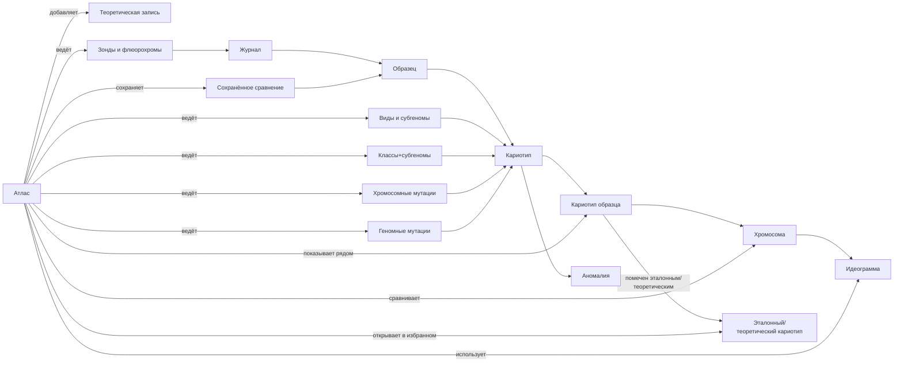

# Атлас Karyolab v2

Атлас - раздел для исследования, сравнения и анализа уже накопленных кариотипов. Его задача - помочь ученому увидеть, как одни и те же классы хромосом, сигналы зондов и аномалии выглядят у разных образцов, найти полиморфизм, сопоставить новый случай с эталоном и поднять близкие исследования из накопленной базы.

Атлас не повторяет журнал и не подменяет кариотип. Журнал ведет лабораторную историю, кариотип собирает результат по конкретному образцу, а атлас работает с накопленным корпусом размеченных хромосом, идеограмм, эталонных кариотипов и теоретических записей.

## Карта Документов

- [01_суть_атласа.md](01_суть_атласа.md) - зачем нужен раздел и какие исследовательские вопросы он закрывает.
- [02_объекты_и_источники_данных.md](02_объекты_и_источники_данных.md) - объекты атласа и два источника данных: лабораторный путь и теоретический.
- [03_зонды_и_флюорохромы.md](03_зонды_и_флюорохромы.md) - справочники зондов и флюорохромов, связь флюорохром -> канал.
- [04_виды_и_субгеномы.md](04_виды_и_субгеномы.md) - справочники видов и субгеномов, гибкие наборы под диплоидов, тетраплоидов, гексаплоидов и нестандартные геномы.
- [05_классы_хромосом_и_аномалии.md](05_классы_хромосом_и_аномалии.md) - объединённое понятие класс+субгеном и два уровня типовых аномалий (хромосомные/геномные).
- [06_эталонные_кариотипы.md](06_эталонные_кариотипы.md) - эталонный (теоретический) кариотип как размеченный кариотип или теоретическая запись, список избранного.
- [07_теоретические_данные.md](07_теоретические_данные.md) - литературные и справочные записи без полной лабораторной цепочки.
- [08_режимы_отображения.md](08_режимы_отображения.md) - три режима отображения хромосомы и идеограммы, выравнивание по центромере.
- [09_сетки_и_сравнения.md](09_сетки_и_сравнения.md) - матрица класс x субгеном x образец, два кариотипа рядом, мультивыбор и тематические сравнения.
- [10_фильтры_и_поиск.md](10_фильтры_и_поиск.md) - фильтры и поиск по зонду, виду, субгеному, классу, аномалии и образцу.
- [11_сценарии_исследования.md](11_сценарии_исследования.md) - типовые исследовательские сценарии: полиморфизм, сиблинги, сравнение с эталоном, переходы из кариотипа.
- [12_границы_с_журналом_и_кариотипом.md](12_границы_с_журналом_и_кариотипом.md) - что атлас делает, а что оставляет журналу и кариотипу.
- [13_дизайн_атласа.md](13_дизайн_атласа.md) - единый дизайн-документ раздела, опирающийся на готовый фронтенд-код.

## Главный Граф Знаний

## Навигационная Модель

В боковом меню `Атлас` — это **один пункт верхнего уровня** рядом с `Журнал` и `Кариотип`. Внутри он раскрывается на **горизонтальные вкладки** (по аналогии с кариотипом, левое меню должно быть минимальным):

- `Матрица` — матрица класс × субгеном × образец, основной экран исследования.
- `Сравнение` — два кариотипа бок о бок и мультивыбор по шаблону.
- `Эталоны` — список избранных эталонных/теоретических кариотипов и быстрый вход в сравнение.
- `Сохранённые сравнения` — список ранее сохранённых раскладок.
- `Справочники` — зонды и флюорохромы, виды и субгеномы, классы+субгеномы, хромосомные и геномные мутации, теоретические записи.

Внутри любого экрана сохраняется один и тот же контекст: выбранный зонд или панель гибридизации, выбранные образцы или эталоны, режим отображения, активные фильтры.

## Основной Принцип

Атлас не создает новых лабораторных фактов. Он показывает то, что уже размечено в кариотипе и зафиксировано в журнале, плюс справочную и литературную базу. Если хромосома пришла из реальной метафазы, то по любой ячейке атласа должно быть возможно вернуться к исходной хромосоме, метафазе и кариотипу образца.

Из этого следуют три правила:

- атлас не редактирует экспертную разметку, сделанную в кариотипе;
- атлас не переписывает лабораторную историю, которую ведет журнал;
- атлас явно отделяет лабораторные данные от теоретических записей.

## Дом Для Справочников

Атлас — дом всех справочников, которые сами по себе не являются ежедневной лабораторной работой, но без которых не работают журнал и кариотип:

- `виды` и их типовые наборы субгеномов (включая шаблоны субгеномов: пшеница, тритикале, рожь, эгилопс и пользовательские);
- `субгеномы`;
- `зонды` и `флюорохромы` с привязкой флюорохрома к каналу (DAPI всегда синий и автоматический);
- `классы+субгеномы` — единый справочник, обозначения вида `1A`, `5D`, `1RS.1BL`;
- `хромосомные мутации` — типы аномалий уровня хромосомы (редактируется оператором);
- `геномные мутации` — типы аномалий уровня кариотипа образца (редактируется оператором);
- `эталонные/теоретические кариотипы` как избранное;
- `теоретические записи`;
- `сохранённые сравнения` — собранные оператором раскладки атласа для повторного использования.

Эти справочники настраиваются редко, но используются постоянно. Поэтому они вынесены в атлас и не загромождают рабочие экраны журнала и кариотипа.

## Связанные Документы

- [[01_суть_атласа]] / [01_суть_атласа.md](01_суть_атласа.md)
- [[02_объекты_и_источники_данных]] / [02_объекты_и_источники_данных.md](02_объекты_и_источники_данных.md)
- [[06_эталонные_кариотипы]] / [06_эталонные_кариотипы.md](06_эталонные_кариотипы.md)
- [[09_сетки_и_сравнения]] / [09_сетки_и_сравнения.md](09_сетки_и_сравнения.md)
- [[12_границы_с_журналом_и_кариотипом]] / [12_границы_с_журналом_и_кариотипом.md](12_границы_с_журналом_и_кариотипом.md)
- [[13_дизайн_атласа]] / [13_дизайн_атласа.md](13_дизайн_атласа.md)
- [[журнал/README|README журнала]] / [../журнал/README.md](../журнал/README.md)
- [[кариотип/README|README кариотипа]] / [../кариотип/README.md](../кариотип/README.md)
