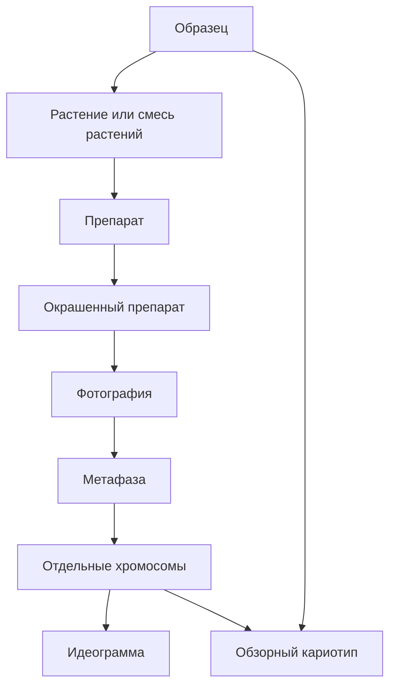

# Объекты И Связи

Основной объект журнала - `образец`. Все остальные сущности должны быть связаны с образцом прямо или через цепочку происхождения. Это нужно, чтобы для любой фотографии, метафазы, хромосомы, идеограммы или обзорного кариотипа можно было восстановить лабораторную историю.

## Иерархия Объектов

## Образец

`Образец` - центральная единица работы. Это может быть номерной образец вида `1730.25` или текстовое имя вроде `ae.speltoides`, `добрыня`, `гром`, `б-1`.

Образец хранит:

- название или ID;
- родителей;
- год посева или получения;
- поколение;
- вид;
- линию и особенности;
- заметки;
- текущий статус;
- растения;
- препараты;
- события, в которых он участвовал;
- обзорные кариотипы и ссылки в раздел кариотипа.

ID образца редактировать опасно. Если редактирование все же нужно, интерфейс должен явно предупреждать, что изменение ID влияет на историю, ссылки и учет.

## Растение

`Растение` - экземпляр внутри образца. Оно появляется, когда по образцу фиксируют отдельные растения, чаще всего на этапе фиксации в холодильнике или при создании препаратов.

Растение может:

- быть источником одного или нескольких препаратов;
- иметь состояние `растет` или `выброшено`;
- потенциально стать будущим образцом, если его посадили дальше и оно стало родителем или новым материалом.

Связь `растение -> будущий образец` пока должна быть описана мягко: это важный сценарий, но точная терминология может уточняться позже.

Важное исключение: у образца может быть режим `смесь растений`. Это нужно, когда материал взят от смеси и нельзя честно сказать, от какого конкретного растения сделан препарат. В таком случае препарат остается индивидуальным и уникальным физическим стеклом, но его источник записывается как `смесь растений`, а не как конкретное растение.

## Препарат

`Препарат` - физическое предметное стекло с материалом от образца. Источником может быть конкретное растение или `смесь растений`, если препарат сделан из смешанного материала.

Препарат хранит:

- образец;
- источник: конкретное растение или `смесь растений`;
- дату создания;
- качество;
- статус;
- место хранения: банка, коробка, холодильник, полка или другой понятный формат;
- комментарий;
- историю отмывок, гибридизаций и фотографирования.

Препарат живет дольше одной окраски. Его можно отмывать и гибридизовать повторно, но не больше трех циклов окраски.

## Окрашенный Препарат

`Окрашенный препарат` - результат конкретной гибридизации физического препарата. Это не новый стеклянный объект, а отдельный цикл окраски со своими зондами, датой, фотографиями и дальнейшей судьбой.

Для физического препарата может быть до трех окрашенных препаратов:

- `окраска 1`;
- `окраска 2`;
- `окраска 3`.

Такое разделение решает тонкий момент со статусами: физический препарат остается тем же, но каждая гибридизация фиксируется как отдельный объект, к которому привязаны зонды и фотографии.

Окрашенный препарат хранит:

- номер цикла окраски;
- дату гибридизации;
- список зондов и каналов;
- статус фотографирования;
- связанные фотографии;
- решение после фотографирования: постгибридизационно отмыт для повторной гибридизации или выброшен.

## Фотографии И Метафазы

Фотографии относятся к окрашенному препарату. Для одной метафазной пластинки может быть несколько фотографий, например разные каналы или несколько снимков одной области.

Для фотографии важно хранить:

- связь с образцом, источником материала, препаратом и окрашенным препаратом;
- информацию о зондах;
- координаты на предметном стекле;
- исходные файлы микроскопа;
- PSD или другие рабочие файлы, если они появились на этапе обработки.

`Метафаза` - логическая единица внутри фотографий. Она нужна, чтобы несколько снимков одной пластинки не превращались в несвязанные файлы.

## Хромосомы, Идеограммы И Обзоры

Эти объекты относятся уже не только к журналу, но журнал должен знать о них через образец:

- `набор отдельных хромосом` создается из фото или PSD;
- `идеограмма` строится для каждой хромосомы или класса;
- `обзорный кариотип` собирается из выбранных представителей хромосом;
- первый созданный кариотип может автоматически стать обзорным, позже пользователь выбирает один или несколько вручную.

Журнал показывает результат на карточке образца, но создание, выбор и редактирование результата относятся к разделу `Кариотип`.

## Минимальное Правило Целостности

Для лабораторных фотографий и рабочих данных кариотипирования нужна полная цепочка происхождения:

`образец -> растение или смесь растений -> препарат -> окрашенный препарат -> фото`.

Если хотя бы одно звено неизвестно, система должна не молча принимать данные, а попросить пользователя выбрать или создать недостающую связь.

Исключение - теоретические или справочные данные для атласа. Если пользователь добавляет теоретическую запись, описание вида, идеограмму, справочный вариант или другой материал, для которого реально существует только название образца или таксона, система не должна заставлять выдумывать растение, препарат, окраску и фото.

Для таких данных нужна альтернативная упрощенная привязка:

`образец или таксон -> теоретическая запись атласа`.

В интерфейсе это должно быть отдельным режимом, например `теоретические данные` или `запись для атласа`, чтобы пользователь явно понимал: это не лабораторная цепочка происхождения, а справочная/аналитическая запись.

## Ивент И Партия

`Ивент` - действие пользователя в журнале. Он создает лабораторные дочерние объекты, меняет статусы и появляется в календаре.

Исключение: сам `образец` создается вручную через форму добавления образца, а не через ивент. После этого ивенты уже работают с созданным образцом: добавляют его в проращивание, создают растения и препараты, меняют статусы и фиксируют историю.

`Партия` - удобная группировка внутри ивента, когда одно действие выполняется сразу для нескольких образцов или препаратов: проращивание партии образцов, отмывка партии препаратов, гибридизация партии отмытых препаратов.

Партия не должна становиться отдельным разделом, который пользователь обязан вести вручную. Для пользователя основная точка входа - `создать ивент`, а партия появляется внутри него там, где действие групповое.

## Связанные Документы

- [[журнал/README|README журнала]] / [README.md](README.md)
- [[03_статусы_и_жизненные_циклы]] / [03_статусы_и_жизненные_циклы.md](03_статусы_и_жизненные_циклы.md)
- [[04_ивенты]] / [04_ивенты.md](04_ивенты.md)
- [[07_карточки]] / [07_карточки.md](07_карточки.md)
- [[10_связь_с_кариотипом_и_атласом]] / [10_связь_с_кариотипом_и_атласом.md](10_связь_с_кариотипом_и_атласом.md)
- [[журнал/11_пользовательские_сценарии|11_пользовательские_сценарии]] / [11_пользовательские_сценарии.md](11_пользовательские_сценарии.md)
