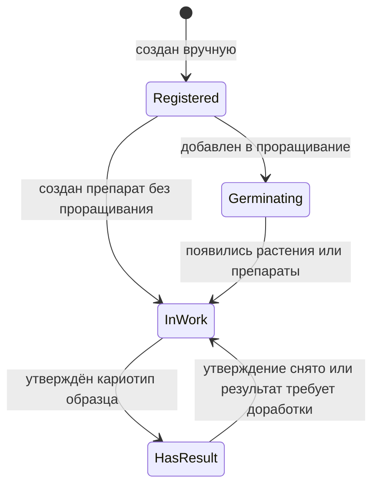
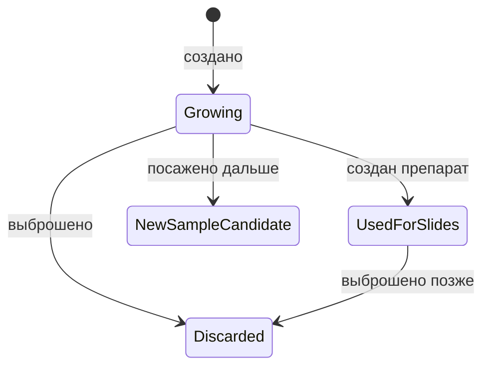
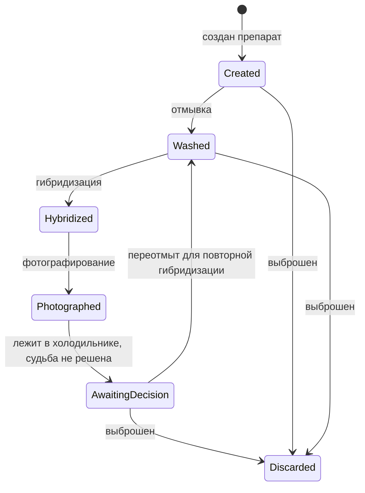
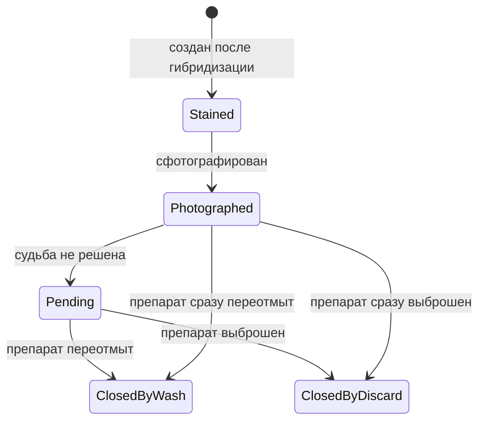

# Статусы И Жизненные Циклы

Статусы в журнале нужны не для красоты, а для навигации по работе. По ним строятся списки прогресса, календарь следующих действий и ограничения в формах: нельзя сфотографировать препарат, который еще не был гибридизован, и нельзя поставить гибридизацию на препарат, который не отмыт.

## Образец

У образца простой верхнеуровневый статус:

### Статусы Образца

- `зарегистрирован` - образец создан вручную, но по нему еще нет лабораторных действий.
- `проращивается` - образец добавлен в партию проращивания, материал еще не дошел до устойчивой стадии работы.
- `в работе` - у образца есть растения, препараты, отмывки, гибридизации или фотографии, но нет готового кариотипа.
- `есть результат` - в разделе кариотипа есть утверждённый кариотип образца. Черновики и кариотипы метафаз сами по себе не переводят образец в этот статус.

Образец может иметь неполную анкету на раннем этапе. Это нормально: пользователь может заранее внести номера семян, а родителей, вид и особенности заполнить позже.

Образец не создается ивентом. Ивенты фиксируют последующие лабораторные действия с уже существующим образцом.

## Растение

Растение живет внутри образца.

Состояния растения:

- `растет` - растение существует и потенциально может дать препараты или стать источником следующего образца;
- `использовано для препаратов` - от растения создан минимум один препарат;
- `выброшено` - растение больше не участвует в работе;
- `кандидат в новый образец` - растение посажено дальше и может стать отдельным образцом или родителем.

## Препарат

Препарат - физическое стекло. Его статус должен отражать, что с ним можно делать дальше.

### Статусы Препарата

В UI допустимы короткие версии названий статусов:

- `создан` - стекло создано, качество и место хранения зафиксированы.
- `отмыт` - стекло прошло предгибридизационную отмывку (или переотмывку после фотографирования) и готово к гибридизации. Подсчёт цикла окраски (1, 2, 3) хранится отдельно.
- `гибридизован` - на стекле есть активная окраска, создан объект окрашенного препарата.
- `сфотографирован` - текущая окраска сфотографирована, но судьба физического стекла ещё не решена. Стекло временно лежит в холодильнике до решения оператора.
- `переотмыт` - после фотографирования выполнена постгибридизационная отмывка, стекло снова доступно для гибридизации. Это разновидность `отмыт`, но в списках выбора подсветка отдельная: видна история циклов окраски.
- `выброшен` - стекло закрыто и не участвует в дальнейшей работе.

После фотографирования физический препарат может остаться в состоянии `сфотографирован` — в неопределённом подвешенном статусе хранения. Это нормальное рабочее состояние: стекло лежит в холодильнике, оператор позже решает его судьбу (переотмывка или выбрасывание).

Постгибридизационная отмывка не является отдельным ивентом журнала. Решение о ней может быть зафиксировано двумя способами:

- сразу в ивенте `фотографирование` — оператор уже знает, что делать со стеклом;
- позже — оператор открывает карточку окрашенного препарата или физического препарата и меняет судьбу. Этот шаг не создаёт нового ивента, но фиксируется в истории препарата.

## Окрашенный Препарат

Окрашенный препарат - отдельный цикл окраски физического препарата. Он нужен, чтобы не смешивать зонды и фотографии разных гибридизаций.

Окрашенный препарат хранит:

- номер окраски: `1`, `2` или `3`;
- дату гибридизации;
- список зондов (канал хранится в зонде в справочнике, дублировать не нужно);
- связанные фотографии;
- статус `создан`, `сфотографирован`, `закрыт переотмывкой`, `закрыт выбрасыванием`;
- допустимо состояние `сфотографирован, судьба не решена` — в нём окрашенный препарат может находиться сколько угодно долго до решения оператора.

Один физический препарат может пройти максимум три окраски. После третьей окраски повторная гибридизация физически невозможна.

## Ограничения Переходов

Система должна запрещать действия, которые ломают лабораторную логику:

- нельзя гибридизовать препарат без статуса `отмыт` (включая случай переотмыт после фотографирования);
- нельзя сфотографировать препарат без активного окрашенного препарата;
- нельзя создать четвертую окраску для одного препарата;
- нельзя импортировать фото без связи с окрашенным препаратом;
- нельзя автоматически менять ID образца без предупреждения.

Состояние `сфотографирован, судьба не решена` ограничением не считается: это допустимое промежуточное состояние, и оно не должно блокировать следующие действия. Оператор сам решит судьбу стекла позже.

## Статусы И Прогресс

Списки прогресса строятся не по последнему ивенту как тексту, а по текущим состояниям объектов.

Колонки прогресса на главной журнала:

- `созрели` — образцы, которые завершили проращивание, но по ним ещё нет ни одного препарата;
- `ждёт отмывку` — препараты со статусом `создан`;
- `отмыт` — препараты со статусом `отмыт` (внутри подсписки `первично отмыт` и `переотмыт`);
- `гибридизован` — препараты с активным окрашенным препаратом без фото;
- `есть результат` — образцы, по которым есть утверждённый кариотип образца. Колонка `есть результат` показывает только три последних номера и кнопку открытия общего списка.

Статус должен быть следствием сохраненного ивента, а не отдельной ручной галочкой. Пользователь выполняет действие `отмывка`, `гибридизация` или `фотографирование`, а система обновляет статус и показывает это в карточках и прогрессе.

## Связанные Документы

- [[02_объекты_и_связи]] / [02_объекты_и_связи.md](02_объекты_и_связи.md)
- [[04_ивенты]] / [04_ивенты.md](04_ивенты.md)
- [[05_проращивание_и_протоколы]] / [05_проращивание_и_протоколы.md](05_проращивание_и_протоколы.md)
- [[09_прогресс_и_поиск_висяков]] / [09_прогресс_и_поиск_висяков.md](09_прогресс_и_поиск_висяков.md)
- [[10_связь_с_кариотипом_и_атласом]] / [10_связь_с_кариотипом_и_атласом.md](10_связь_с_кариотипом_и_атласом.md)
- [[журнал/11_пользовательские_сценарии|11_пользовательские_сценарии]] / [11_пользовательские_сценарии.md](11_пользовательские_сценарии.md)
