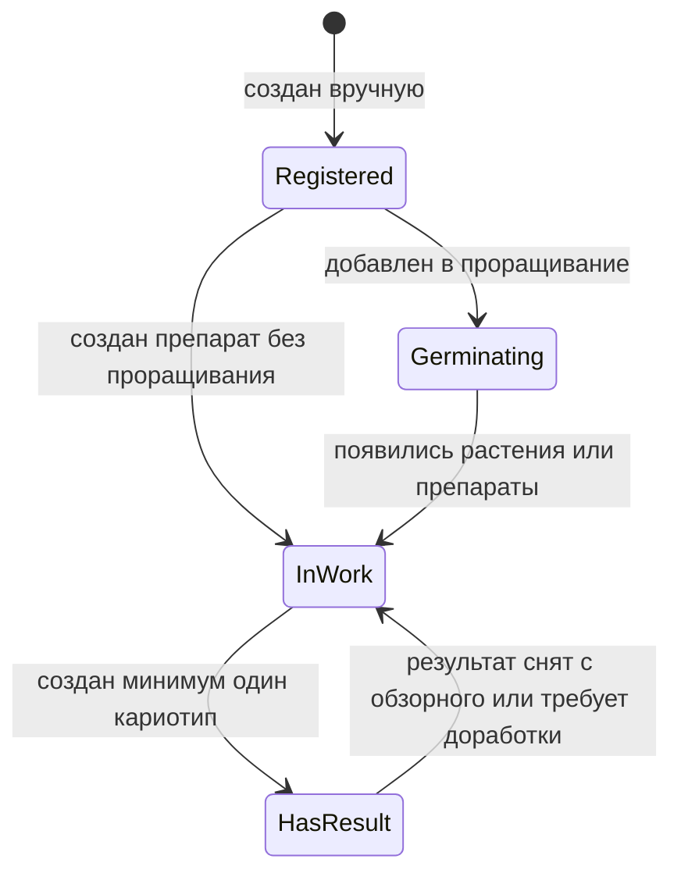
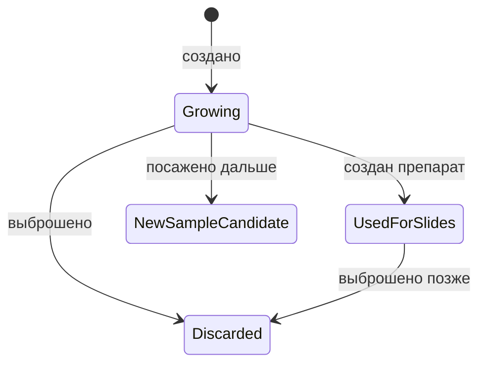
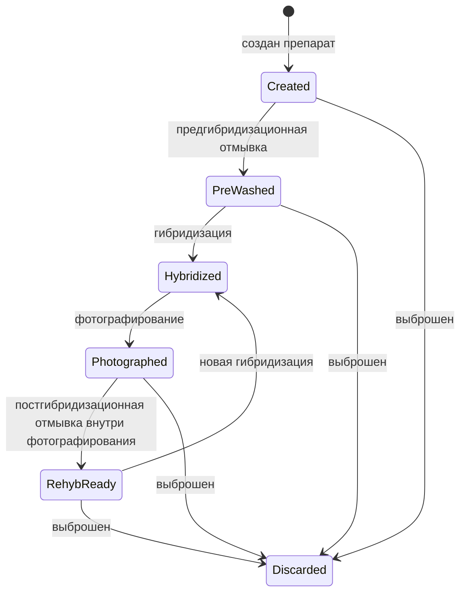
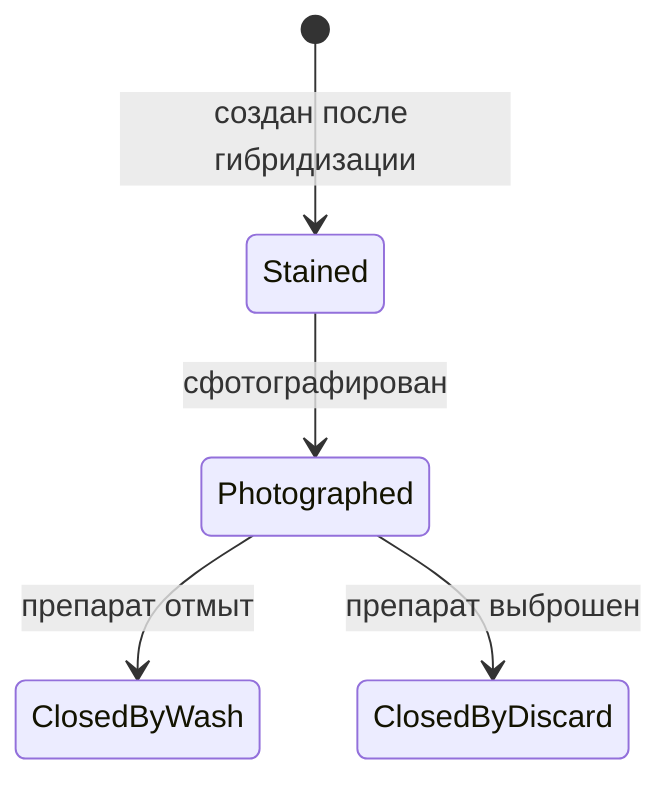

# Статусы И Жизненные Циклы

Статусы в журнале нужны не для красоты, а для навигации по работе. По ним строятся списки прогресса, календарь следующих действий и ограничения в формах: нельзя сфотографировать препарат, который еще не был гибридизован, и нельзя поставить гибридизацию на препарат, который не отмыт.

## Образец

У образца простой верхнеуровневый статус:

### Статусы Образца

- `зарегистрирован` - образец создан вручную, но по нему еще нет лабораторных действий.
- `проращивается` - образец добавлен в партию проращивания, материал еще не дошел до устойчивой стадии работы.
- `в работе` - у образца есть растения, препараты, отмывки, гибридизации или фотографии, но нет готового кариотипа.
- `есть результат` - в разделе кариотипа создан минимум один кариотип или обзор по образцу.

Образец может иметь неполную анкету на раннем этапе. Это нормально: пользователь может заранее внести номера семян, а родителей, вид и особенности заполнить позже.

Образец не создается ивентом. Ивенты фиксируют последующие лабораторные действия с уже существующим образцом.

## Растение

Растение живет внутри образца.

Состояния растения:

- `растет` - растение существует и потенциально может дать препараты или стать источником следующего образца;
- `использовано для препаратов` - от растения создан минимум один препарат;
- `выброшено` - растение больше не участвует в работе;
- `кандидат в новый образец` - растение посажено дальше и может стать отдельным образцом или родителем.

## Препарат

Препарат - физическое стекло. Его статус должен отражать, что с ним можно делать дальше.

### Статусы Препарата

- `создан` - стекло создано, качество и место хранения зафиксированы.
- `предгибридизационно отмыт` - стекло прошло отдельный ивент отмывки и готово к первой или очередной гибридизации.
- `гибридизован` - на стекле есть активная окраска, создан объект окрашенного препарата.
- `сфотографирован` - текущая окраска сфотографирована.
- `готов к повторной гибридизации` - после фотографирования выполнена постгибридизационная отмывка внутри ивента фотографирования, стекло снова доступно для гибридизации.
- `выброшен` - стекло закрыто и не участвует в дальнейшей работе.

После фотографирования препарат должен получить дальнейшую судьбу: `постгибридизационно отмыт` для повторной гибридизации или `выброшен`. Нельзя оставлять его в неопределенном состоянии. Постгибридизационная отмывка не является отдельным ивентом журнала, она фиксируется внутри события фотографирования.

## Окрашенный Препарат

Окрашенный препарат - отдельный цикл окраски физического препарата. Он нужен, чтобы не смешивать зонды и фотографии разных гибридизаций.

Окрашенный препарат хранит:

- номер окраски: `1`, `2` или `3`;
- дату гибридизации;
- зонды и каналы;
- связанные фотографии;
- статус `создан`, `сфотографирован`, `закрыт постгибридизационной отмывкой`, `закрыт выбрасыванием`.

Один физический препарат может пройти максимум три окраски. После третьей окраски повторная гибридизация недоступна, если пользователь явно не меняет правило проекта.

## Ограничения Переходов

Система должна запрещать действия, которые ломают лабораторную логику:

- нельзя гибридизовать препарат без статуса `предгибридизационно отмыт` или `готов к повторной гибридизации`;
- нельзя сфотографировать препарат без активного окрашенного препарата;
- нельзя создать четвертую окраску для одного препарата;
- нельзя закрыть окрашенный препарат постгибридизационной отмывкой или выбрасыванием без решения судьбы физического препарата;
- нельзя импортировать фото без связи с окрашенным препаратом;
- нельзя автоматически менять ID образца без предупреждения.

## Статусы И Прогресс

Списки прогресса строятся не по последнему ивенту как тексту, а по текущим состояниям объектов.

Например:

- образец без препаратов после созревания попадает в `созрели, но нет препарата`;
- препарат `создан` попадает в колонку `создан`;
- препарат `предгибридизационно отмыт` или `готов к повторной гибридизации` попадает в `отмыт, но не гибридизован`;
- окрашенный препарат без фото попадает в `гибридизован, но не сфотографирован`;
- образец с кариотипом попадает в `есть результат`.

Статус должен быть следствием сохраненного ивента, а не отдельной ручной галочкой. Пользователь выполняет действие `предгибридизационная отмывка`, `гибридизация` или `фотографирование`, а система обновляет статус и показывает это в карточках и прогрессе.

## Связанные Документы

- [[02_объекты_и_связи]] / [02_объекты_и_связи.md](02_объекты_и_связи.md)
- [[04_ивенты]] / [04_ивенты.md](04_ивенты.md)
- [[05_проращивание_и_протоколы]] / [05_проращивание_и_протоколы.md](05_проращивание_и_протоколы.md)
- [[09_прогресс_и_поиск_висяков]] / [09_прогресс_и_поиск_висяков.md](09_прогресс_и_поиск_висяков.md)
- [[10_связь_с_кариотипом_и_атласом]] / [10_связь_с_кариотипом_и_атласом.md](10_связь_с_кариотипом_и_атласом.md)
- [[журнал/11_пользовательские_сценарии|11_пользовательские_сценарии]] / [11_пользовательские_сценарии.md](11_пользовательские_сценарии.md)
