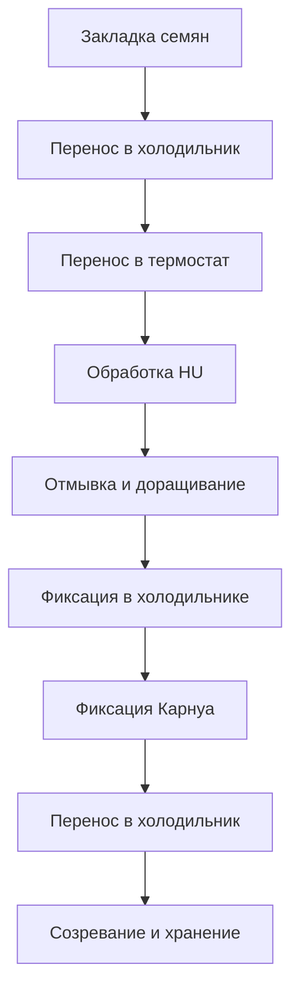

# Проращивание И Протоколы

Проращивание - длинный лабораторный процесс, который начинается с закладки семян и заканчивается созреванием материала и переносом на хранение. В журнале он должен отображаться не как одна короткая запись, а как протокол с временной линией и под-ивентами.

## Общая Идея

Один ивент проращивания может включать несколько существующих образцов. Для пользователя это выглядит как `проращивание партия дата начала`, внутри которого есть список образцов и расписание этапов.

В календаре проращивание должно быть длинной плашкой, протянутой от начала процесса до конца. Под-ивенты тоже должны быть видны в соответствующие дни и часы.

## Таймлайн

## Этапы Проращивания

### Закладка Семян

Дата создания процесса. На этом этапе пользователь выбирает список образцов, которые участвуют в партии.

Первые данные могут быть неполными: иногда у пользователя есть только номера семян, а родители, вид и особенности будут заполнены позже.

### Перенос В Холодильник

Отображается в календаре между закладкой семян и переносом в термостат. Количество дней плавающее и должно редактироваться.

### Перенос В Термостат

Дата и время задаются пользователем. От этой точки дальше идет жесткий протокольный каркас.

Длительность: 2 часа.

### Обработка HU

Длительность: 18 часов.

### Отмывка И Доращивание

Длительность: 5 часов.

### Фиксация В Холодильнике

Длительность: 24 часа.

На этом этапе пользователь должен иметь возможность создать объект `растение` для каждого образца:

- выбрать количество растений;
- или выбрать режим `смесь растений`, если отдельное деление на растения не ведется.

Если выбран режим `смесь растений`, дальше пользователь может создавать препараты от этой смеси. Такие препараты считаются индивидуальными физическими стеклами, но не привязываются к конкретному растению.

### Фиксация Карнуа

Длительность: 48 часов.

### Перенос В Холодильник

Длительность: 2 недели.

### Созревание И Перенос На Хранение

После созревания можно делать препараты. Физически возможность может появляться раньше, но по протоколу журнал должен вести пользователя к этому этапу как к нормальному моменту продолжения работы.

## Редактируемость

Первые три этапа динамичные и должны быть редактируемыми:

- закладка семян;
- перенос в холодильник;
- перенос в термостат.

Эти три даты редактируются сразу после создания ивента и остаются редактируемыми до момента создания растений на этапе фиксации. После переноса в термостат система рассчитывает следующие этапы автоматически по длительностям протокола.

Этап `перенос в холодильник → 2 недели до созревания` показывается на календаре полупрозрачной плашкой, чтобы не отвлекать визуально и не забивать сетку.

## Отображение В Календаре

Календарь должен показывать:

- длинную плашку всего проращивания;
- ключевые под-ивенты на нужных датах;
- будущие этапы, если они рассчитаны;
- завершенные этапы как выполненные;
- просроченные этапы как требующие внимания.

Проращивание нельзя отображать только в день старта: это главный длинный процесс журнала.

## Карточка Проращивания

Карточка ивента проращивания должна показывать:

- название партии;
- дату начала;
- список образцов;
- текущий этап;
- полный таймлайн;
- ожидаемые даты следующих этапов;
- созданные растения;
- комментарии.

По макету карточка проращивания должна быть интерактивной, а не просто текстовой. В ней нужны:

- верхняя сводка: текущий статус, оператор, срок завершения, кнопка завершить ивент;
- список образцов справа с видом, рабочим названием и состоянием в партии;
- таймлайн под-ивентов с отмеченными выполненными этапами;
- редактируемые поля для первых динамических дат;
- автосчитанные даты для жестких этапов после термостата;
- явная кнопка `создать растения` на этапе фиксации в холодильнике;
- кнопки `сохранить изменения` и, при необходимости, `экспорт в PDF`.

Если пользователь меняет дату переноса в термостат, все последующие жесткие этапы пересчитываются и показываются до сохранения, чтобы было понятно, какие даты изменятся.

## Связь С Прогрессом

После созревания образцы должны попадать в список `созрели, но нет препарата`, если по ним еще не созданы препараты. Это один из главных списков висяков.

## Связанные Документы

- [[04_ивенты]] / [04_ивенты.md](04_ивенты.md)
- [[03_статусы_и_жизненные_циклы]] / [03_статусы_и_жизненные_циклы.md](03_статусы_и_жизненные_циклы.md)
- [[06_экраны_журнала]] / [06_экраны_журнала.md](06_экраны_журнала.md)
- [[07_карточки]] / [07_карточки.md](07_карточки.md)
- [[09_прогресс_и_поиск_висяков]] / [09_прогресс_и_поиск_висяков.md](09_прогресс_и_поиск_висяков.md)
