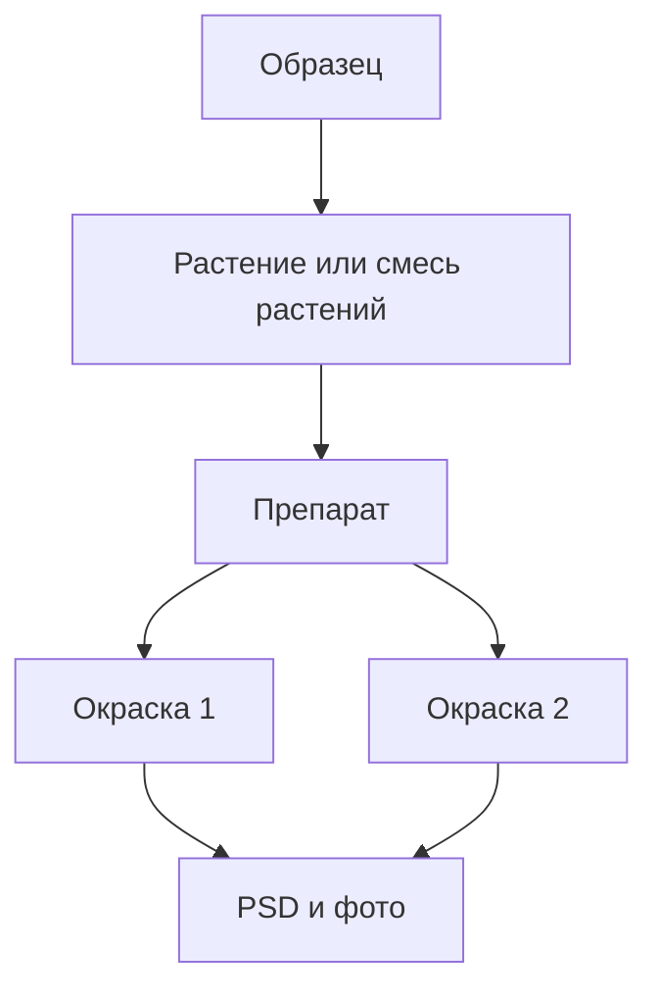

# Карточки

Карточки нужны для перехода от общей картины к конкретным объектам. В журнале должны быть минимум две важные карточки: карточка образца и карточка ивента.

## Карточка Образца

Источник макета: `karyolab_v2/скрины макетов/карточка образца.png`.

Карточка образца - главная точка входа в историю одного образца.

Она должна показывать:

- ID или название образца;
- предупреждение при опасных изменениях ID;
- кнопку архивировать;
- кнопку редактировать;
- базовую информацию;
- последние события;
- кариотипы образца и кариотипы метафаз (превью-плитками; если несколько — все сразу, без скрытых в выпадающих списках);
- сохранённые сравнения из атласа, в которых участвовал образец, со ссылками на сами сравнения;
- ссылку в `Импорт/Кариотип/Экспорт`;
- дерево растений, препаратов, гибридизаций и файлов.

Карточка не должна быть тупиковой страницей. Если по образцу очевиден следующий лабораторный шаг, рядом с соответствующим блоком должна быть кнопка действия: `создать препарат`, `отмыть выбранные`, `поставить гибридизацию`, `сфотографировать`, `открыть в кариотипе`.

## Базовая Информация Образца

Поля:

- год регистрации или посева;
- вид;
- родители;
- поколение;
- линия;
- особенности;
- заметки.

Редактирование должно открываться отдельной кнопкой, чтобы пользователь случайно не изменил данные.

ID образца редактировать можно только с предупреждением. В большинстве случаев ID должен быть стабильным.

## Таймлайн Образца

В блоке событий показываются лабораторные действия по образцу:

- создан;
- добавлен в проращивание;
- отмыт;
- гибридизован;
- сфотографирован;
- есть результат.

По умолчанию таймлайн не показывает технические JSON-события. Каждая запись должна быть человекочитаемой и кликабельной.

## Кариотип И Файлы

Блок кариотипа показывает результаты по образцу:

- один или несколько кариотипов образца — превью-плитками, все сразу;
- кариотипы метафаз — отдельным компактным списком;
- изображения, связанные с кариотипами;
- кнопку `открыть в кариотипе`;
- кнопку добавления файла, если пользователь вручную связывает результат.

Карточка не назначает один кариотип образца "главным" автоматически. Если есть несколько кариотипов образца, на карточке показываются все их превью одновременно — оператор выбирает взглядом.

## Иерархия Растений И Препаратов

Блок `растения и препараты` должен быть подробнее, чем в макете.

Минимальная вложенность:

Для растения показывать:

- номер или имя растения;
- состояние: растет, выброшено, использовано;
- место или комментарий, если есть.

Если препарат сделан из `смеси растений`, в дереве должна быть отдельная ветка `Смесь растений`. Такие препараты не привязываются к конкретному растению, но остаются отдельными физическими препаратами со своими ID, качеством, статусом и хранением.

Для препарата показывать:

- ID препарата;
- дату создания;
- качество;
- статус;
- место хранения;
- меню действий.

Для каждой гибридизации или окраски показывать:

- номер окраски;
- дату;
- зонды и каналы;
- статус фотографирования;
- связанные PSD/TIF/фото;
- дальнейшую судьбу препарата после фото.

В дереве важно показывать не только последний статус препарата, но и историю циклов окраски. Пользователь должен видеть, что один и тот же физический препарат мог пройти `окраску 1`, потом быть постгибридизационно отмыт внутри фотографирования, потом пройти `окраску 2` с другими зондами. PSD и фото должны быть привязаны к конкретной окраске, а не просто лежать в общей куче образца.

## Карточка Ивента

Источник макета: `karyolab_v2/скрины макетов/карточка ивента отмывка.png`.

Карточка ивента показывает итог конкретного действия.

Общие поля:

- тип ивента;
- название;
- дата и время;
- статус выполнения;
- оператор, если используется;
- комментарий;
- связанные образцы;
- связанные препараты;
- действия вроде печати этикетки или экспорта лога, если они нужны.

Карточка ивента должна быть итогом действия, поэтому ее главный вопрос - `что изменилось`. Для групповых событий лучше показывать таблицу: образец, объект действия, исходное состояние, новое состояние, хранение, комментарий.

На всех карточках ивентов обязательно должна быть явная ссылка на карточку образца. Это главный переход для пользователя. Сопутствующие объекты - растение, смесь растений, препарат, окраска, фото - лучше открывать через карточку образца и ее дерево, а не вести пользователя по цепочке на предыдущий этап.

## Карточка Отмывки

Для отмывки карточка должна показывать:

- название партии (`WP-{дата}`);
- дату;
- время;
- статус выполнения;
- список отмытых препаратов;
- исходный образец каждого препарата;
- качество;
- новое место хранения;
- ссылку на карточку образца в каждой строке.

Отдельный блок `образцы партии` в правой колонке не нужен — кликабельные ссылки в таблице препаратов достаточно. Дублировать переходы в виде сайдбарного блока не имеет смысла.

Фильтр `проблемы качества` не нужен как основная функция: качество — ручной экспертный отбор оператора, а не то, что софт должен активно сортировать. Если фильтр все-таки нужен позже, он должен быть вторичным и не заменять переход через образец.

Клик по образцу ведет в карточку образца. Клик по препарату может раскрывать строку или подсвечивать его внутри карточки образца, но главный путь к сопутствующим объектам должен идти через образец.

## Карточки Других Ивентов

Карточка проращивания:

- список образцов;
- таймлайн протокола с редактируемыми датами на первых трёх под-ивентах (`закладка семян`, `перенос в холодильник`, `перенос в термостат`). Для остальных этапов даты считаются автоматически по жёсткому протоколу и редактированию не подлежат;
- текущий этап;
- кнопка `создать растения` появляется ТОЛЬКО на этапе `фиксация в холодильнике` (под-ивент 5). На первых трёх этапах кнопки создания растений быть не должно: это противоречит протоколу. Создание растений физически возможно только после фиксации;
- созданные растения;
- следующие действия.

Карточка создания препарата:

- образец;
- ссылка на карточку образца;
- созданный препарат или список препаратов;
- источник материала каждого препарата (растение или `смесь растений`) - выводится как столбец таблицы препаратов;
- качество;
- место хранения.

Отдельный сайдбарный блок `источник материала` не нужен: он повторяет столбец таблицы. Единственное место, где источник отображается, - таблица препаратов внутри ивента. Это убирает визуальный дубликат и оставляет таблицу единственным источником правды по препаратам ивента.

Если интерфейс агрегирует несколько индивидуальных созданий за день в одну календарную плашку, карточка может показывать список препаратов. Но первичный смысл действия остается индивидуальным: каждый препарат создан вручную и отдельно.

Карточка гибридизации:

- образцы с обязательными ссылками на карточки;
- выбранные препараты;
- номер окраски по каждому препарату;
- зонды и каналы;
- для постгибридизационно отмытых препаратов в строке - история предыдущих окрасок в формате `1-GAA.pAs1.pAs119 / 2-GAA.pAs1.pAs119.pTa713`. Это позволяет видеть, что стекло уже окрашивалось, без перехода в карточку образца;
- дата начала и ожидаемое окончание;
- статус.

Также для гибридизации нужно показывать номер цикла окраски по каждому препарату и предупреждение, если это последняя допустимая окраска.

Карточка фотографирования:

- образцы с обязательными ссылками на карточки;
- окрашенные препараты;
- ссылка на фото или будущий импорт;
- решение по каждому препарату: `переотмыт`, `выброшен` или `решу позже`;
- новое место хранения, если препарат переотмыт;
- возможность изменить решение по каждому препарату прямо из карточки ивента (без создания нового ивента) — это нужно, когда судьба стекла решается уже после фотографирования.

В сводке фотографирования отдельно считать `готовы к повторной гибридизации`, `выброшены` и `ждут решения`. Это помогает быстро понять, какие препараты вернутся в прогресс, какие закрыты навсегда, а какие лежат в холодильнике и ждут решения. Отдельная карточка ивента постгибридизационной отмывки не нужна: она является частью фотографирования.

Карточка свободного ивента:

- название;
- дата и время;
- текст заметки;
- вложения;
- теги - выводятся реальные теги, заданные пользователем при создании ивента, а не захардкоженный набор;
- кнопки редактирования и удаления;
- отметка автора или проверившего, если это нужно для лабораторной дисциплины.

## Кликабельность

В карточках все ключевые объекты должны быть ссылками:

- образец открывает карточку образца, это обязательная ссылка на всех карточках ивентов;
- растение или `смесь растений` раскрывается внутри карточки образца;
- препарат открывает соответствующий блок в карточке образца;
- ивент открывает карточку ивента;
- кариотип открывает раздел кариотипа;
- фото или PSD открывают импорт/кариотип.

Не нужно строить основную навигацию как переход `ивент -> предыдущий этап -> еще более ранний этап`. Пользователю проще и надежнее попасть в карточку образца и уже там увидеть всю связанную иерархию.

## Связанные Документы

- [[02_объекты_и_связи]] / [02_объекты_и_связи.md](02_объекты_и_связи.md)
- [[03_статусы_и_жизненные_циклы]] / [03_статусы_и_жизненные_циклы.md](03_статусы_и_жизненные_циклы.md)
- [[04_ивенты]] / [04_ивенты.md](04_ивенты.md)
- [[06_экраны_журнала]] / [06_экраны_журнала.md](06_экраны_журнала.md)
- [[10_связь_с_кариотипом_и_атласом]] / [10_связь_с_кариотипом_и_атласом.md](10_связь_с_кариотипом_и_атласом.md)
- [[журнал/11_пользовательские_сценарии|11_пользовательские_сценарии]] / [11_пользовательские_сценарии.md](11_пользовательские_сценарии.md)
