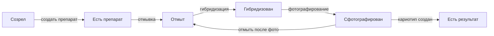

# Прогресс И Поиск Висяков

Прогресс - один из главных рабочих блоков журнала. Он отвечает на вопрос: что уже можно продолжать, а что зависло на промежуточной стадии.

Списки прогресса должны строиться по состоянию объектов, а не по ручным заметкам. Если препарат отмыт, он должен появиться в списке доступных для гибридизации. Если образец созрел, но по нему нет препаратов, он должен висеть в отдельной колонке.

## Основные Колонки

На главной странице показываются списки по стадиям:

- `созрели` - образцы созрели, но препаратов еще нет;
- `есть препарат` - препараты созданы, но не отмыты;
- `отмыт` - препараты отмыты, но не гибридизованы;
- `гибридизован и отмыт` - препарат уже прошел окраску и снова доступен для следующей гибридизации;
- `сфотографирован` - окрашенный препарат сфотографирован;
- `есть результат` - по образцу создан минимум один кариотип.

В макете эта зона называется `Sample Progress Lifecycle`.

Каждая колонка показывает крупное число объектов в стадии и несколько последних или самых срочных строк. Полный список открывается по клику на колонку или кнопку `view all`, если она нужна. На главной важно не показать все, а быстро подсветить, где накопилась работа.

## Как Попадают В Колонки

## Созрели, Но Нет Препарата

Сюда попадают образцы после завершения проращивания и созревания, если у них нет ни одного препарата.

Действие из списка: `создать препарат`.

## Есть Препарат, Но Не Отмыт

Сюда попадают препараты со статусом `создан`.

Действие из списка: выбрать препараты для ивента `отмывка`.

## Отмыт, Но Не Гибридизован

Сюда попадают препараты со статусом `отмыт` или `отмыт после фото`, если они доступны для новой гибридизации.

Действие из списка: выбрать препараты для ивента `гибридизация`.

## Гибридизован, Но Не Сфотографирован

Сюда попадают активные окрашенные препараты без статуса `сфотографирован`.

Действие из списка: добавить ивент `фотографирование`.

## Сфотографирован

Сюда попадают окрашенные препараты, по которым фото уже сделаны, но результат по образцу еще не собран.

В этой колонке важно понимать дальнейшую судьбу физического препарата:

- если препарат отмыт, он может снова появиться в `отмыт`;
- если выброшен, он больше не участвует в цикле;
- если фото импортированы, пользователь может перейти в кариотип.

## Есть Результат

Сюда попадают образцы, по которым создан минимум один кариотип или обзор.

Действие из списка: открыть карточку образца или перейти в раздел кариотипа/атласа.

## Поиск И Фильтры

В списках прогресса нужны:

- поиск по ID образца;
- фильтр по виду;
- фильтр по году;
- фильтр по статусу;
- быстрый переход в карточку образца;
- быстрый переход к созданию следующего ивента.

Быстрые действия должны работать с выбранными объектами. Например, пользователь отмечает несколько отмытых препаратов в колонке `отмыт`, нажимает `создать гибридизацию`, и форма гибридизации открывается уже с этими препаратами.

## Приоритет Висяков

Списки лучше сортировать не только по дате создания, но и по срочности:

- просроченные протокольные шаги выше обычных;
- давно созревшие образцы выше свежих;
- отмытые препараты, которые долго ждут гибридизации, выше новых;
- активные окраски без фотографирования выше закрытых циклов;
- объекты с проблемным качеством или критичным комментарием отмечаются отдельным бейджем.

## Что Считать Висяком

Висяк - это объект, у которого есть очевидный следующий шаг, но он еще не сделан.

Примеры:

- образец созрел 2 недели назад, но препарат не создан;
- препарат создан, но не отмыт;
- препарат отмыт и лежит готовым к гибридизации;
- окрашенный препарат не сфотографирован;
- фотографии есть, но кариотип не собран.

Висяки должны быть видны без необходимости открывать каждую карточку.

## Связанные Документы

- [[01_суть_журнала]] / [01_суть_журнала.md](01_суть_журнала.md)
- [[03_статусы_и_жизненные_циклы]] / [03_статусы_и_жизненные_циклы.md](03_статусы_и_жизненные_циклы.md)
- [[04_ивенты]] / [04_ивенты.md](04_ивенты.md)
- [[06_экраны_журнала]] / [06_экраны_журнала.md](06_экраны_журнала.md)
- [[10_связь_с_кариотипом_и_атласом]] / [10_связь_с_кариотипом_и_атласом.md](10_связь_с_кариотипом_и_атласом.md)
- [[11_пользовательские_сценарии]] / [11_пользовательские_сценарии.md](11_пользовательские_сценарии.md)
