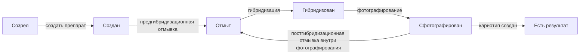

# Прогресс И Поиск Висяков

Прогресс - компактный рабочий блок журнала. Он отвечает на вопрос: что уже можно продолжать, а что зависло на промежуточной стадии.

Списки прогресса должны строиться по состоянию объектов, а не по ручным заметкам. Если препарат отмыт, он должен появиться в списке доступных для гибридизации. Если образец созрел, но по нему нет препаратов, он должен висеть в отдельной колонке.

## Основные Колонки

На главной странице показываются списки по стадиям:

- `создан` - препараты созданы, но не отмыты;
- `отмыт` - препараты готовы к гибридизации;
- `гибридизован` - окрашенные препараты ждут фотографирования;
- `сфотографирован` - окрашенный препарат сфотографирован;
- `есть результат` - по образцу создан минимум один кариотип.

В макете эта зона называется `Sample Progress Lifecycle`.

На главной не нужно показывать полный список объектов. Каждая колонка показывает крупное число и несколько последних строк для примера. Полный список открывается по клику на колонку или кнопку `открыть все` / `открыть полный список`. Все эти кнопки ведут на одну и ту же отдельную страницу `Образцы` - центральный список всех образцов с фильтром по выбранному статусу (`?status=created`, `?status=washed` и так далее). Эта страница - единая точка входа в общий справочник образцов и не должна вести обратно на главную журнала.

Строки в прогрессе должны быть простыми: номер образца или препарата, короткий статус и, где важно, дополнительная пометка. Не нужно превращать нижний прогресс в полноценные карточки. ID объекта в строке должен сохранять префикс образца, чтобы по любой строке прогресса было видно, к какому образцу она относится.

В колонке `отмыт` нужно два подсписка, разделённых тонкой горизонтальной линией:

- сверху - `первично отмыт` - препараты после предгибридизационной отмывки, готовые к первой или очередной гибридизации;
- снизу (под линией-разделителем) - `переотмытые` (синоним `отмыт от гибридизации`) - препараты, которые были сфотографированы и постгибридизационно отмыты для повторной гибридизации.

Во втором подсписке рядом с номером препарата обязательно показывать:

- количество прошлых отмывок (`×2`, `×3`);
- список зондов предыдущих циклов в компактной форме `1-GAA.pAs1 / 2-pAs119.pTa713`. Это не только последний цикл, а вся история окрасок, чтобы было понятно, после каких именно гибридизаций стекло вернулось в работу.

## Как Попадают В Колонки

## Созрели, Но Нет Препарата

Этот список может быть отдельным от основных колонок препаратов. Сюда попадают образцы после завершения проращивания и созревания, если у них нет ни одного препарата.

Действие из списка: `создать препарат`.

## Создан

Сюда попадают препараты со статусом `создан`.

Действие из списка: выбрать препараты для ивента `предгибридизационная отмывка`.

## Отмыт, Но Не Гибридизован

Сюда попадают препараты со статусом `предгибридизационно отмыт` или `готов к повторной гибридизации`, если они доступны для новой гибридизации.

Внутри этого блока нужно визуально разделить тонкой горизонтальной линией два подсписка:

- сверху `первично отмыт`;
- снизу `переотмытые` (`отмыт от гибридизации`).

Для строки в подсписке `переотмытые` рядом с номером показываются:

- количество прошлых отмывок (`×N`);
- история окрасок в формате `1-GAA.pAs1 / 2-pAs119.pTa713` - все предыдущие циклы, а не только последний.

Действие из списка: выбрать препараты для ивента `гибридизация`.

## Гибридизован, Но Не Сфотографирован

Сюда попадают активные окрашенные препараты без статуса `сфотографирован`.

Действие из списка: добавить ивент `фотографирование`.

## Сфотографирован

Сюда попадают окрашенные препараты, по которым фото уже сделаны, но результат по образцу еще не собран.

В этой колонке важно понимать дальнейшую судьбу физического препарата:

- если препарат постгибридизационно отмыт, он может снова появиться в `отмыт`;
- если выброшен, он больше не участвует в цикле;
- если фото импортированы, пользователь может перейти в кариотип.

Важно: повторное появление в `отмыт` после фотографирования происходит не через отдельный ивент отмывки. Пользователь выбирает судьбу препарата в ивенте `фотографирование`, и если выбран вариант постгибридизационной отмывки, препарат становится готовым к повторной гибридизации.

## Есть Результат

Сюда попадают образцы, по которым создан минимум один кариотип или обзор.

На главной в этом блоке не нужен весь список результатов. Достаточно показать несколько последних примеров и кнопку `открыть все`. Кнопка ведёт на ту же страницу `Образцы` с фильтром `?status=result` - пользователь видит все образцы с готовым результатом и может оттуда перейти в карточку конкретного образца.

Действие из строки: открыть карточку образца или перейти в раздел кариотипа/атласа.

## Поиск И Фильтры

В списках прогресса нужны:

- поиск по ID образца;
- фильтр по виду;
- фильтр по году;
- фильтр по статусу;
- быстрый переход в карточку образца;
- быстрый переход к созданию следующего ивента.

Быстрые действия должны работать с выбранными объектами. Например, пользователь отмечает несколько препаратов, готовых к гибридизации, в колонке `отмыт`, нажимает `создать гибридизацию`, и форма гибридизации открывается уже с этими препаратами.

## Приоритет Висяков

Списки лучше сортировать не только по дате создания, но и по срочности:

- просроченные протокольные шаги выше обычных;
- давно созревшие образцы выше свежих;
- отмытые препараты, которые долго ждут гибридизации, выше новых;
- активные окраски без фотографирования выше закрытых циклов;
- объекты с критичным комментарием отмечаются отдельным бейджем.

Фильтры и сортировка по качеству не должны быть основной механикой журнала. Качество препарата - это прежде всего ручной экспертный отбор пользователя, а не автоматический критерий, по которому софт должен активно вести работу.

## Что Считать Висяком

Висяк - это объект, у которого есть очевидный следующий шаг, но он еще не сделан.

Примеры:

- образец созрел 2 недели назад, но препарат не создан;
- препарат создан, но не отмыт;
- препарат отмыт и лежит готовым к гибридизации;
- окрашенный препарат не сфотографирован;
- фотографии есть, но кариотип не собран.

Висяки должны быть видны без необходимости открывать каждую карточку.

## Связанные Документы

- [[01_суть_журнала]] / [01_суть_журнала.md](01_суть_журнала.md)
- [[03_статусы_и_жизненные_циклы]] / [03_статусы_и_жизненные_циклы.md](03_статусы_и_жизненные_циклы.md)
- [[04_ивенты]] / [04_ивенты.md](04_ивенты.md)
- [[06_экраны_журнала]] / [06_экраны_журнала.md](06_экраны_журнала.md)
- [[10_связь_с_кариотипом_и_атласом]] / [10_связь_с_кариотипом_и_атласом.md](10_связь_с_кариотипом_и_атласом.md)
- [[журнал/11_пользовательские_сценарии|11_пользовательские_сценарии]] / [11_пользовательские_сценарии.md](11_пользовательские_сценарии.md)
