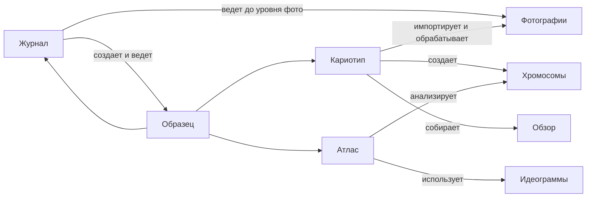

# Связь С Кариотипом И Атласом

Журнал, кариотип и атлас работают вокруг одного центрального объекта - `образца`, но отвечают за разные уровни данных.

Журнал отвечает за физическую лабораторную историю. Кариотип отвечает за импорт, обработку фотографий, выделение хромосом и сборку результата. Атлас отвечает за анализ накопленных хромосом, идеограмм, зондов и полиморфизмов.

## Границы Разделов

## Что Делает Журнал

Журнал создает и ведет:

- образцы;
- растения;
- препараты;
- окрашенные препараты;
- события лабораторной обработки;
- статусы и места хранения;
- ссылки на фотографии;
- ссылки на обзорные кариотипы.

До момента фотографий журнал должен точно знать происхождение данных: от какого образца, растения, препарата и гибридизации получены снимки.

## Что Делает Кариотип

Раздел `Кариотип` раскрывается на `Импорт`, `Кариотип`, `Экспорт`.

Он отвечает за:

- импорт PSD/TIF и связанных файлов;
- привязку файлов к образцу, препарату и гибридизации;
- создание метафаз;
- выделение отдельных хромосом;
- выбор представителей хромосом;
- сборку одного или нескольких кариотипов образца;
- экспорт итоговых картинок.

Когда в кариотипе создан хотя бы один кариотип по образцу, журнал получает обратную связь: статус образца меняется на `есть результат`.

## Что Делает Атлас

Атлас работает с уже накопленными данными:

- хромосомами;
- идеограммами;
- зондами;
- классами хромосом;
- полиморфизмами;
- обзорами по образцам.

Журнал не должен перегружаться аналитическими функциями атласа. Но из карточки образца должна быть понятная навигация к данным образца в атласе, если они уже есть.

## Обзорный Кариотип На Карточке Образца

На карточке образца должен отображаться обзорный кариотип:

- первый созданный кариотип может автоматически стать обзорным;
- если кариотипов несколько, пользователь выбирает, какие показывать;
- можно отображать несколько файлов, например для разных зондов;
- выбор и создание происходят в разделе `Кариотип`, а карточка журнала только показывает результат и дает ссылку открыть его.

## Импорт Фото

При импорте фотографий нельзя оставлять их без привязки. Минимальный каскад выбора:

1. выбрать образец;
2. выбрать источник материала: растение или `смесь растений`, если это нужно для контекста;
3. выбрать препарат;
4. выбрать окрашенный препарат или гибридизацию;
5. импортировать фото или PSD.

После успешного импорта фотографий журнал может обновить состояние окрашенного препарата: он становится `сфотографирован`, если пользователь явно подтвердил, что фото относятся к этому циклу окраски.

В пользовательском сценарии переход должен быть прямым: после ивента `фотографирование` пользователь видит кнопку `открыть импорт фото`. Импорт открывается уже с выбранной окраской или просит выбрать ее из ограниченного списка, чтобы не искать образец заново вручную.

## Теоретические Данные Для Атласа

Для атласа нужна альтернатива полной лабораторной цепочке. Иногда пользователь добавляет теоретические или справочные данные, где нет реального растения, препарата, гибридизации и фотографии. Например, есть только название образца, вида, линии или таксона и аналитическое описание.

В таком сценарии система не должна требовать выдумывать недостающие звенья. Достаточно привязки к образцу или таксону и явной пометки, что это `теоретическая запись` или `справочные данные атласа`.

Такие записи:

- не попадают в лабораторный прогресс журнала;
- не создают препараты, окраски или фото;
- не считаются доказанными лабораторными результатами;
- могут использоваться в атласе для сравнения, справки, гипотез и будущей ручной привязки.

Если позже появятся реальные фото и кариотип, пользователь сможет создать нормальную лабораторную цепочку отдельно, не переписывая теоретическую запись задним числом.

## Правило Обратной Связи

Журнал должен показывать результат, но не должен дублировать работу кариотипа.

Хорошая граница:

- журнал отвечает на вопрос `что физически происходило с материалом`;
- кариотип отвечает на вопрос `что получилось на снимках и как собран кариотип`;
- атлас отвечает на вопрос `что эти данные значат в сравнении с другими образцами`.

## Связанные Документы

- [[README]] / [README.md](README.md)
- [[02_объекты_и_связи]] / [02_объекты_и_связи.md](02_объекты_и_связи.md)
- [[03_статусы_и_жизненные_циклы]] / [03_статусы_и_жизненные_циклы.md](03_статусы_и_жизненные_циклы.md)
- [[07_карточки]] / [07_карточки.md](07_карточки.md)
- [[09_прогресс_и_поиск_висяков]] / [09_прогресс_и_поиск_висяков.md](09_прогресс_и_поиск_висяков.md)
- [[11_пользовательские_сценарии]] / [11_пользовательские_сценарии.md](11_пользовательские_сценарии.md)
