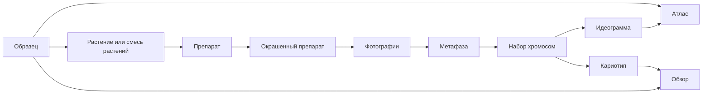

# Журнал Karyolab v2

Журнал - раздел для учета реальной лабораторной работы с физическими объектами: семенами, растениями, препаратами, окрасками, стеклами, фотографиями и результатами. Его задача - заменить бумажный или Excel-журнал так, чтобы по каждому образцу было понятно, что уже сделано, что висит, где лежит материал и какой следующий шаг.

Журнал не является просто календарем. Образец создается вручную как центральная сущность, а дальнейшие лабораторные действия создают связанные объекты или меняют их статусы: проращивание добавляет уже созданные образцы в процесс, создание препарата создает препарат от растения или смеси растений, предгибридизационная отмывка меняет состояние и место хранения препарата, гибридизация создает окрашенный препарат с выбранными зондами, фотографирование закрывает цикл окраски и решает судьбу стекла.

## Карта Документов

- [01_суть_журнала.md](01_суть_журнала.md) - зачем нужен журнал и какую боль он закрывает.
- [02_объекты_и_связи.md](02_объекты_и_связи.md) - основные сущности и их связи.
- [03_статусы_и_жизненные_циклы.md](03_статусы_и_жизненные_циклы.md) - статусы образца, препарата и окрашенного препарата.
- [04_ивенты.md](04_ивенты.md) - типы событий и что они делают с объектами.
- [05_проращивание_и_протоколы.md](05_проращивание_и_протоколы.md) - длинный таймлайн проращивания и протокольные этапы.
- [06_экраны_журнала.md](06_экраны_журнала.md) - главная страница, календарь, меню, формы событий.
- [07_карточки.md](07_карточки.md) - карточка образца и карточка ивента.
- [08_заметки_и_тильт.md](08_заметки_и_тильт.md) - заметки, архив, поиск и счетчик тильта.
- [09_прогресс_и_поиск_висяков.md](09_прогресс_и_поиск_висяков.md) - списки прогресса и поиск зависших материалов.
- [10_связь_с_кариотипом_и_атласом.md](10_связь_с_кариотипом_и_атласом.md) - границы журнала, кариотипа и атласа.
- [11_пользовательские_сценарии.md](11_пользовательские_сценарии.md) - как пользователь работает с журналом в интерфейсе.
- [12_дизайн_журнала.md](12_дизайн_журнала.md) - визуальный бриф для фронтенда журнала.

## Главный Граф Знаний

## Навигационная Модель

В интерфейсе верхнего уровня есть три основных блока:

- `Журнал` - календарь, лента событий, прогресс, карточки образцов и ивентов, заметки, тильт.
- `Кариотип` - раскрывается на `Импорт`, `Кариотип`, `Экспорт`; работает с фотографиями, метафазами, хромосомами и обзорными кариотипами.
- `Атлас` - анализ накопленных данных по образцам, хромосомам, зондам и идеограммам.

Журнал остается центральной точкой учета. Даже когда пользователь работает в кариотипе или атласе, исходная привязка идет от образца и его лабораторной истории.

## Основной Принцип

Объект `образец` - главный якорь системы. Все остальные данные должны позволять ответить на вопрос: из какого образца, растения, препарата, окраски, фотографии и метафазы получен конкретный результат.

Если данные нельзя привязать к этой цепочке, они считаются неполными для рабочей базы.

## Связанные Документы

- [[01_суть_журнала]] / [01_суть_журнала.md](01_суть_журнала.md)
- [[02_объекты_и_связи]] / [02_объекты_и_связи.md](02_объекты_и_связи.md)
- [[03_статусы_и_жизненные_циклы]] / [03_статусы_и_жизненные_циклы.md](03_статусы_и_жизненные_циклы.md)
- [[04_ивенты]] / [04_ивенты.md](04_ивенты.md)
- [[10_связь_с_кариотипом_и_атласом]] / [10_связь_с_кариотипом_и_атласом.md](10_связь_с_кариотипом_и_атласом.md)
- [[11_пользовательские_сценарии]] / [11_пользовательские_сценарии.md](11_пользовательские_сценарии.md)
- [[12_дизайн_журнала]] / [12_дизайн_журнала.md](12_дизайн_журнала.md)
