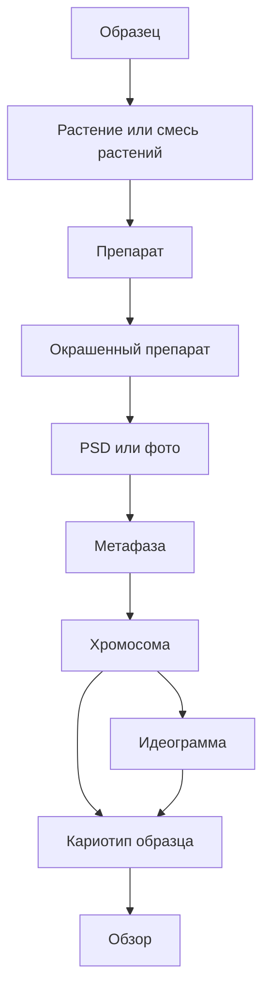

# Объекты И Происхождение Данных

Кариотип работает с теми же образцами, что и журнал, но на другом уровне. Журнал отвечает за лабораторную историю, а кариотип - за изображения, метафазы, хромосомы, идеограммы и итоговые обзоры.

Главное правило: любой результат должен позволять восстановить путь от итоговой картинки назад к физическому материалу.

## Иерархия Объектов

## Система Именования

Кариотип использует ту же систему имён, что и журнал: канонический ID любого дочернего объекта строится как `<id-родителя>.<порядковый номер>`. Подробное описание - в [журнал/02_объекты_и_связи.md](../журнал/02_объекты_и_связи.md#система-именования). Хромосомы получают имя `<метафаза>.c<NN>`, идеограммы - `<хромосома>.idg`, обзорные кариотипы - `<образец>.kar.<n>`. Это правило позволяет по любому имени файла или объекту восстановить путь до исходного образца.

## Образец

`Образец` остается главным якорем системы. Он может иметь номерной ID вроде `1730.25` или текстовое имя вроде `ae.speltoides`, `добрыня`, `гром`, `б-1`.

Для кариотипа особенно важны:

- ID образца;
- вид или линия;
- родители и поколение, если они известны;
- набор ожидаемых субгеномов;
- статус результата;
- связи с препаратами, гибридизациями, метафазами и обзорами.

Когда в кариотипе сформирован подтвержденный результат, журнал должен увидеть это как изменение статуса образца на `есть результат`.

## Препарат И Окрашенный Препарат

`Препарат` - физическое стекло. `Окрашенный препарат` - конкретный цикл гибридизации этого стекла с выбранными зондами.

Кариотип не должен импортировать PSD в пустоту. Минимальная привязка при импорте:

1. образец;
2. растение или `смесь растений`;
3. препарат;
4. окрашенный препарат;
5. набор зондов и каналы;
6. метафаза или фото.

Если PSD называется так, что в имени есть образец, зонды, номер фото и координаты, программа может использовать это как подсказку. Но пользователь должен подтвердить связь с правильным окрашенным препаратом.

## PSD Или Фото

PSD в актуальном сценарии - рабочий файл после внешней обработки, где:

- есть фон;
- каждая хромосома лежит на отдельном слое;
- имя файла содержит полезные метаданные;
- слой можно превратить в отдельный объект-хромосому.

PSD сохраняется рядом с импортированными производными файлами. Он нужен как исходник для проверки и повторного разбора.

## Метафаза

`Метафаза` - логическая единица внутри окрашенного препарата и фото. В ней лежит набор хромосом, полученный из одной метафазной пластинки.

Метафаза хранит:

- связь с окрашенным препаратом;
- исходный PSD или фото;
- координаты, если они есть в имени файла или метаданных;
- список извлеченных хромосом;
- статус обработки;
- качество или комментарий эксперта.

Метафаза может быть неполной или сомнительной. Система не должна требовать, чтобы в каждой метафазе было ровно идеальное количество хромосом.

## Хромосома

`Хромосома` - отдельный объект, извлеченный из слоя PSD или созданный другим способом.

Она хранит:

- связь с метафазой;
- исходный слой;
- изображение или кроп;
- маску;
- размер по маске;
- канонический ID вида `<метафаза>.cNN` (например, `1730.25.1.1.1.m1.c01`); этот ID не меняется при разметке;
- разметочное имя класса (`displayName`: `1A`, `5D`, `1RS.1BL`) - заполняется после ручной разметки и не подменяет ID;
- статус уверенности;
- идеограмму, если она создана.

Имя файла может измениться после определения класса, но главным источником правды должны оставаться структурированные данные.

## Идеограмма

`Идеограмма` - схема хромосомы. Она нужна не вместо фото, а рядом с фото.

Идеограмма хранит:

- длину хромосомы;
- положение центромеры;
- красные сигналы;
- зеленые сигналы;
- блоки, точки и отрезки;
- аномалии;
- подписи и комментарии;
- графическое представление.

Для атласа и сравнения особенно важна цифровая часть идеограммы: координаты сигналов должны быть нормализованы вдоль длины хромосомы.

## Обзор

`Обзор` - итоговая картинка или файл экспорта. Он собирается из выбранных хромосом и может показывать:

- один образец;
- несколько образцов;
- один или несколько наборов зондов;
- хромосомы с идеограммами;
- только хромосомы;
- только идеограммы;
- аномалии и подписи.

Обзор не должен быть потерянной PNG-картинкой. Важно хранить, какие именно хромосомы вошли в каждую ячейку.

## Связанные Документы

- [[кариотип/README|README кариотипа]] / [README.md](README.md)
- [[01_суть_кариотипа]] / [01_суть_кариотипа.md](01_суть_кариотипа.md)
- [[03_импорт_psd_и_метафазы]] / [03_импорт_psd_и_метафазы.md](03_импорт_psd_и_метафазы.md)
- [[04_хромосома_как_рабочий_объект]] / [04_хромосома_как_рабочий_объект.md](04_хромосома_как_рабочий_объект.md)
- [[05_идеограммы_и_сигналы]] / [05_идеограммы_и_сигналы.md](05_идеограммы_и_сигналы.md)
- [[12_границы_с_журналом_и_атласом]] / [12_границы_с_журналом_и_атласом.md](12_границы_с_журналом_и_атласом.md)
