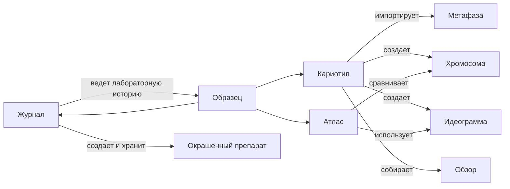

# Границы С Журналом И Атласом

Журнал, кариотип и атлас работают вокруг одного `образца`, но отвечают за разные вопросы.

- `Журнал` - что физически происходило с материалом.
- `Кариотип` - что получилось на фотографиях и как собран результат.
- `Атлас` - что эти данные значат в сравнении с другими образцами, зондами и литературой.

## Граф Границ

## Что Делает Журнал

Журнал создает и ведет:

- образцы;
- растения или смеси растений;
- препараты;
- окрашенные препараты;
- ивенты лабораторной работы;
- статусы;
- места хранения;
- факт фотографирования;
- ссылки на результаты кариотипа.

Журнал должен довести пользователя до момента `можно открыть импорт`, но не должен превращаться в редактор хромосом.

## Что Делает Кариотип

Кариотип отвечает за:

- импорт PSD и фото;
- извлечение хромосом;
- создание метафаз;
- разметку хромосом;
- создание идеограмм;
- разметку генома;
- выбор лучших хромосом;
- сборку результата образца;
- экспорт обзорных изображений и рабочих таблиц.

Когда в кариотипе появляется утвержденный результат, журнал получает статус `есть результат`.

## Что Делает Атлас

Атлас работает с накопленными данными:

- хромосомами;
- идеограммами;
- зондами;
- классами;
- аномалиями;
- полиморфизмами;
- литературными и справочными записями.

Атлас не должен требовать полной лабораторной цепочки для теоретических данных. Но лабораторные результаты из кариотипа должны приходить в атлас с полной историей происхождения.

## Переходы Между Разделами

Нужны прямые переходы:

- из события `фотографирование` в импорт кариотипа;
- из карточки образца в кариотипы образца;
- из обзора на карточке образца в экспортный файл;
- из таблицы аномалий в атлас;
- из атласа обратно к исходной хромосоме или кариотипу.

Переход должен сохранять контекст. Если пользователь пришел из карточки образца, не нужно заново искать образец в импорте.

## Что Не Дублировать

Журнал не должен:

- размечать хромосомы;
- хранить ручную раскладку генома как основной интерфейс;
- редактировать идеограммы;
- управлять шаблонами экспорта.

Кариотип не должен:

- создавать лабораторные ивенты вместо журнала;
- решать, где физически лежит стекло;
- вести календарь протокола.

Атлас не должен:

- менять исходную лабораторную историю;
- незаметно переписывать экспертную разметку кариотипа.

## Связанные Документы

- [[кариотип/README|README кариотипа]] / [README.md](README.md)
- [[02_объекты_и_происхождение_данных]] / [02_объекты_и_происхождение_данных.md](02_объекты_и_происхождение_данных.md)
- [[08_лицевой_кариотип_образца]] / [08_лицевой_кариотип_образца.md](08_лицевой_кариотип_образца.md)
- [[10_сводные_таблицы_и_поиск]] / [10_сводные_таблицы_и_поиск.md](10_сводные_таблицы_и_поиск.md)
- [[кариотип/11_пользовательские_сценарии|11_пользовательские_сценарии]] / [11_пользовательские_сценарии.md](11_пользовательские_сценарии.md)
- [[журнал/10_связь_с_кариотипом_и_атласом|10_связь_с_кариотипом_и_атласом]] / [../журнал/10_связь_с_кариотипом_и_атласом.md](../журнал/10_связь_с_кариотипом_и_атласом.md)
