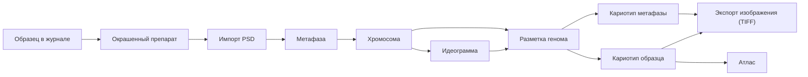

# Кариотип Karyolab v2

Кариотип - раздел для работы с цифровыми данными после фотографирования: импорт PSD, извлечение отдельных хромосом, создание идеограмм, раскладка по геному, сборка кариотипа образца и экспорт обзорных изображений.

Главная задача раздела - не заменить эксперта, а убрать рутину вокруг ручного FISH-кариотипирования. Программа должна сохранить происхождение каждой хромосомы, помочь быстро разметить сигналы и аномалии, собрать понятный обзор и оставить данные в таком виде, чтобы их потом можно было искать, сравнивать и использовать в атласе.

## Карта Документов

- [01_суть_кариотипа.md](01_суть_кариотипа.md) - зачем нужен раздел и какую боль он закрывает.
- [02_объекты_и_происхождение_данных.md](02_объекты_и_происхождение_данных.md) - объекты кариотипа и цепочка происхождения данных.
- [03_импорт_psd_и_метафазы.md](03_импорт_psd_и_метафазы.md) - импорт PSD, привязка к окрашенному препарату и создание метафазы.
- [04_хромосома_как_рабочий_объект.md](04_хромосома_как_рабочий_объект.md) - отдельная хромосома как объект анализа.
- [05_идеограммы_и_сигналы.md](05_идеограммы_и_сигналы.md) - центромера, каналы, сигналы, аномалии и графическая идеограмма.
- [06_разметка_генома.md](06_разметка_генома.md) - распределение хромосом по субгеномам и классам.
- [07_аномалии_замещения_и_нестандартные_кариотипы.md](07_аномалии_замещения_и_нестандартные_кариотипы.md) - хромосомные и геномные мутации, источник типов — справочник атласа.
- [08_лицевой_кариотип_образца.md](08_лицевой_кариотип_образца.md) - кариотип образца и кариотип метафазы: чем они отличаются и как сохраняются.
- [09_экспорт_и_шаблоны_обзоров.md](09_экспорт_и_шаблоны_обзоров.md) - сборка итоговых изображений и шаблоны экспорта.
- [10_сводные_таблицы_и_поиск.md](10_сводные_таблицы_и_поиск.md) - таблицы, счетчики и рабочий поиск.
- [11_пользовательские_сценарии.md](11_пользовательские_сценарии.md) - путь пользователя от PSD до готового обзора.
- [12_границы_с_журналом_и_атласом.md](12_границы_с_журналом_и_атласом.md) - связь кариотипа с журналом и атласом.
- [13_экраны_и_ux_кариотипа.md](13_экраны_и_ux_кариотипа.md) - общая структура экранов и UX-правила.
- [14_дизайн_импорта.md](14_дизайн_импорта.md) - дизайн вкладки импорта.
- [15_дизайн_разметки_хромосом.md](15_дизайн_разметки_хромосом.md) - дизайн экрана создания идеограмм.
- [16_дизайн_разметки_генома.md](16_дизайн_разметки_генома.md) - дизайн матрицы генома.
- [17_дизайн_экспорта.md](17_дизайн_экспорта.md) - дизайн экспорта и конфигурации обзоров.

## Главный Граф Знаний

## Навигационная Модель

Раздел `Кариотип` в боковом меню — это **один пункт**. Внутри он раскрывается на три **горизонтальные вкладки** наверху страницы (не в боковом меню):

- `Импорт` — загрузить PSD, выбрать окрашенный препарат, извлечь хромосомы из слоёв, проверить метаданные и сохранить результат.
- `Кариотип` — разметить отдельные хромосомы, создать идеограммы, распределить хромосомы по субгеномам и классам, выбрать лучшие хромосомы для результата образца.
- `Экспорт` — собрать обзорные изображения (TIFF) и таблицы (Excel/текст) по шаблонам.

Подразделы вынесены в верхние вкладки намеренно: левое меню должно быть минимальным, потому что в кариотипе много визуальных рабочих областей.

Внутри вкладки `Кариотип` есть два режима: `разметка хромосомы` и `разметка генома`. Первый описывает отдельную хромосому (центромера, сигналы, аномалии, идеограмма), второй собирает картину по метафазе или гибридизации.

## Основной Принцип

Каждая картинка в кариотипе должна оставаться связанной с происхождением:

`образец → растение или смесь растений → препарат → окрашенный препарат → фото или PSD → метафаза → хромосома → идеограмма → кариотип метафазы / кариотип образца → экспорт изображения`.

Если пользователь видит в обзоре хромосому `1B`, система должна знать, из какой метафазы, какого PSD, какого препарата и какой гибридизации она пришла.

Кариотип образца хранит **копии файлов выбранных хромосом**, а не ссылки на них в исходных метафазах — это нужно, чтобы кариотип не менялся, если в исходной метафазе хромосому отредактировали или удалили.

## Роль Эксперта

Karyolab не должен притворяться автоматическим диагностом. Он помогает:

- быстро разобрать PSD на отдельные хромосомы;
- не потерять связь с образцом и препаратами;
- структурировать разметку центромеры, сигналов и аномалий;
- предложить автоматическую раскладку там, где есть достаточно данных;
- оставить эксперту возможность исправить, подтвердить или отложить решение.

Итоговый научный ответ остается экспертным решением, а программа хранит его в воспроизводимом виде.

## Связанные Документы

- [[01_суть_кариотипа]] / [01_суть_кариотипа.md](01_суть_кариотипа.md)
- [[02_объекты_и_происхождение_данных]] / [02_объекты_и_происхождение_данных.md](02_объекты_и_происхождение_данных.md)
- [[03_импорт_psd_и_метафазы]] / [03_импорт_psd_и_метафазы.md](03_импорт_psd_и_метафазы.md)
- [[06_разметка_генома]] / [06_разметка_генома.md](06_разметка_генома.md)
- [[08_лицевой_кариотип_образца]] / [08_лицевой_кариотип_образца.md](08_лицевой_кариотип_образца.md)
- [[09_экспорт_и_шаблоны_обзоров]] / [09_экспорт_и_шаблоны_обзоров.md](09_экспорт_и_шаблоны_обзоров.md)
- [[12_границы_с_журналом_и_атласом]] / [12_границы_с_журналом_и_атласом.md](12_границы_с_журналом_и_атласом.md)
- [[журнал/README|README журнала]] / [../журнал/README.md](../журнал/README.md)
