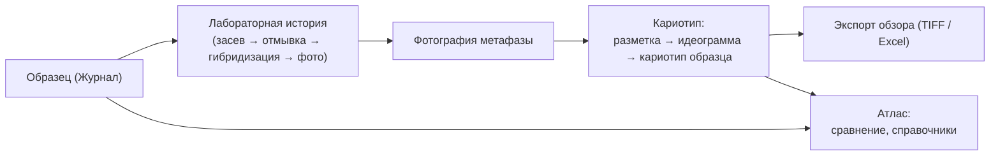

# Общая Концепция Karyolab v2

Karyolab v2 — это рабочая система для учёных-цитогенетиков. Она помогает вести лабораторию и собирать кариотипы, не теряя историю каждого результата.

Программа состоит из **трёх связанных разделов**:

1. **Журнал** — что физически происходило с материалом.
2. **Кариотип** — что получилось на фотографиях и как собран результат.
3. **Атлас** — что эти результаты значат в сравнении с другими образцами и с накопленным справочником.

Эти разделы не повторяют друг друга. Каждый отвечает на свой вопрос.

## Журнал

Журнал — это **электронный лабораторный дневник**. Он заменяет бумажные журналы и Excel-таблицы.

В журнале фиксируется:

- засев семян и проращивание;
- создание препарата от растения или смеси растений;
- отмывка препарата;
- гибридизация с выбранными зондами;
- фотографирование и судьба препарата (выброшен, переотмыт, "решу позже");
- свободные ивенты и заметки.

В журнале хранятся объекты лабораторной работы:

- образцы;
- растения и смеси растений;
- препараты;
- окрашенные препараты;
- ивенты с датами;
- ссылки на полученные кариотипы.

Журнал доводит пользователя до момента "можно открыть кариотип" и не превращается в редактор хромосом. Подробнее: [03_журнал_концепция.md](03_журнал_концепция.md).

## Кариотип

Кариотип — это **рабочая мастерская для разметки**. Здесь оператор:

- импортирует PSD-файл фотографии метафазы со слоями хромосом;
- проверяет, что слои корректно превратились в хромосомы;
- размечает каждую хромосому (центромера, сигналы зондов, аномалии) — получается идеограмма;
- распределяет хромосомы по классам и субгеномам;
- собирает **кариотип метафазы** (по одной метафазе) или **кариотип образца** (лучшие хромосомы из всех метафаз гибридизации);
- экспортирует обзорные изображения (TIFF) и таблицы данных (Excel/текст).

Кариотип не создаёт лабораторных ивентов и не ведёт календарь — он работает с уже существующими образцами и препаратами из журнала. Подробнее: [04_кариотип_концепция.md](04_кариотип_концепция.md).

## Атлас

Атлас — это **накопленные знания и инструменты сравнения**. Здесь оператор:

- сравнивает кариотипы между собой (два рядом, мультивыбор, по классу, по субгеному);
- хранит эталонные (теоретические) кариотипы для разных видов;
- ведёт справочники: зонды, флюорохромы, виды, субгеномы, классы хромосом, типы аномалий;
- сохраняет интересные сравнения как объекты `Сохранённое сравнение`, чтобы вернуться к ним позже;
- ищет похожие случаи, полиморфизмы, повторяющиеся аномалии.

Атлас не редактирует лабораторную историю и не переделывает экспертную разметку — он показывает то, что уже размечено в кариотипе и зафиксировано в журнале. Подробнее: [05_атлас_концепция.md](05_атлас_концепция.md).

## Связь Между Разделами

Все три раздела вращаются вокруг **образца**.

- Журнал даёт фотографию.
- Кариотип превращает фотографию в размеченные хромосомы и кариотип.
- Атлас сравнивает результат с другими и со справочниками.

Все объекты на пути сохраняют связь с **исходным образцом**. Из любой ячейки атласа можно вернуться к карточке образца в журнале и посмотреть полную лабораторную историю.

## Принцип "Программа Помогает, Эксперт Решает"

Karyolab — не диагност и не автомат. Программа:

- предлагает разметку центромеры по маске слоя, но оператор её корректирует;
- предлагает разложить хромосомы по классам, но оператор подтверждает;
- хранит типы аномалий, но **типы добавляет и редактирует оператор** — программа ничего не навязывает;
- считает готовность кариотипа по числу хромосом из настроек вида, но не блокирует экспорт неполного кариотипа, если оператор пометил это как осознанную аномалию.

Итоговый научный ответ остаётся экспертным. Программа гарантирует, что этот ответ воспроизводим: каждый результат привязан к фотографии, метафазе, окрашенному препарату, гибридизации и образцу.

## Почему Так

Эта концепция выросла из реальной работы лаборатории. Главные требования заказчика:

- **не теряем историю** — каждая хромосома знает, из какого PSD, какой метафазы и какого образца она пришла;
- **не дублируем данные** — если хромосома уже размечена в кариотипе, атлас её только показывает, а не хранит копию;
- **не навязываем терминологию** — словари аномалий, классов, видов настраиваются под лабораторию;
- **не превращаем разметку в кликающий конвейер** — экспертные решения остаются за человеком;
- **не теряем кариотип, если хромосому удалили в исходной метафазе** — кариотип образца хранит копии файлов хромосом.

Дальше каждый раздел разбирается подробнее.

## Связанные Документы

- [02_данные_и_иерархия.md](02_данные_и_иерархия.md)
- [03_журнал_концепция.md](03_журнал_концепция.md)
- [04_кариотип_концепция.md](04_кариотип_концепция.md)
- [05_атлас_концепция.md](05_атлас_концепция.md)
- [06_аномалии_и_замещения.md](06_аномалии_и_замещения.md)
- [07_термины_и_словарь.md](07_термины_и_словарь.md)
- [08_рабочие_сценарии.md](08_рабочие_сценарии.md)
