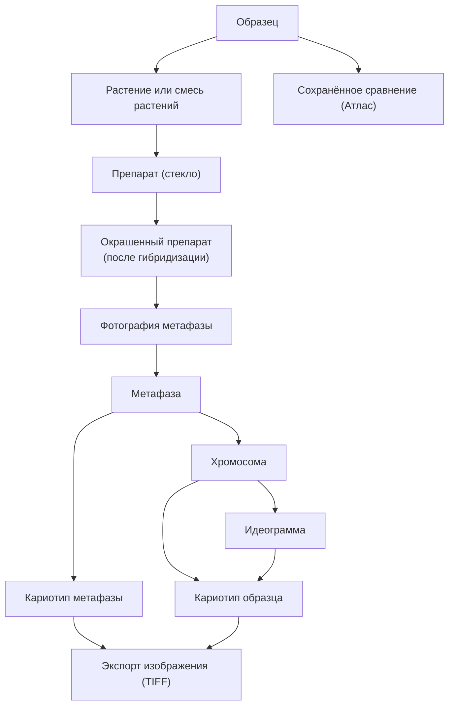

# Данные И Иерархия

В Karyolab v2 все объекты выстроены в одну цепочку, идущую от **образца**. Если объект не привязан к этой цепочке, он считается неполным.

## Главная Цепочка



## Что Это Все Такое

### Образец

Якорь системы. Образец — это **физический материал**: семена одного источника, гибрид, линия, инбред. У образца есть имя, вид, родители, год, место хранения.

Образец создаётся вручную в журнале. Все остальные объекты появляются как его потомки.

### Растение Или Смесь Растений

После проращивания из образца получаются растения. В программе можно отметить:

- одно растение,
- смесь растений (несколько проростков, использованных вместе).

### Препарат

Препарат — это **физическое стекло** с давленным материалом. Создаётся в журнале как отдельный объект, привязанный к растению или смеси.

Состояния препарата (см. [журнал/03_статусы_и_жизненные_циклы.md](../журнал/03_статусы_и_жизненные_циклы.md)):

- `создан` — лежит в базовом состоянии;
- `отмыт` — прошёл отмывку, готов к гибридизации;
- `гибридизован` — есть окрашенный препарат;
- `сфотографирован, судьба не решена` — после фото оператор может решить позже;
- `переотмыт` — отмыт повторно для новой гибридизации;
- `выброшен`.

### Окрашенный Препарат

Один и тот же препарат можно гибридизовать несколько раз с разными зондами (после отмывки). Каждая гибридизация даёт **отдельный окрашенный препарат**. У окрашенного препарата хранятся:

- набор зондов; канал определяется через флюорохром зонда (DAPI всегда синий и автоматический);
- дата гибридизации;
- полученные фотографии метафаз.

### Фотография Метафазы

Сырая фотография под микроскопом, прикреплённая к окрашенному препарату.

### Метафаза

Метафаза — это **выбранный участок фотографии**, на котором видна полноценная разложенная картинка хромосом. Один окрашенный препарат может дать несколько метафаз.

### Хромосома

Хромосома — это **отдельный объект**, извлечённый из метафазы. На этапе импорта PSD каждый слой превращается в хромосому. Хромосома получает канонический ID `<метафаза>.cNN`, который **не меняется** даже при переименовании файла.

### Идеограмма

Идеограмма — это **схема хромосомы**, размеченная оператором: центромера, сигналы зондов (4 типа: маленькая точка, точка, большая точка, отрезок), хромосомные аномалии. Размер хромосомы и положение центромеры — одна шкала с тремя ползунками (две точки размера + центромера).

### Кариотип Метафазы

Кариотип, собранный **по одной метафазе**. У одного образца может быть много кариотипов метафаз (по одному на каждую метафазу, которую оператор разметил).

ID: `<метафаза>.kar.<n>`.

### Кариотип Образца

Кариотип, собранный **из лучших хромосом по всей гибридизации** (выборка из всех метафаз). У одного образца может быть несколько кариотипов образца — например, по разным растениям или разным гибридизациям.

ID: `<образец>.kar.<n>`.

При сохранении кариотипа образца программа **копирует файлы хромосом** в его собственную папку. Это нужно, чтобы кариотип не сломался, если в исходной метафазе хромосома была удалена или заменена.

### Экспорт Изображения

Экспорт — это **результирующий файл** для публикации, отчёта или печати. Это объект, который тоже хранится у образца, чтобы можно было переоткрыть и пересобрать.

Форматы:

- **TIFF** для изображений (максимальное качество, без ползунка);
- **Excel/текст** для таблиц данных (не картинка таблицы).

### Сохранённое Сравнение

Объект из атласа: оператор настроил раскладку (например, "образец vs три эталона") и сохранил её. Сохранённое сравнение появляется и в атласе, и на карточке каждого участвующего образца.

## Принцип Именования

Имя дочернего объекта строится **иерархически**: `<id-родителя>.<порядковый номер>`.

Пример полного пути:

```
1730.25            — образец
1730.25.1          — растение
1730.25.1.1        — препарат
1730.25.1.1.1      — окрашенный препарат
1730.25.1.1.1.f1   — фотография метафазы
1730.25.1.1.1.m1   — метафаза
1730.25.1.1.1.m1.c01  — хромосома
1730.25.1.1.1.m1.c01.id1  — идеограмма
1730.25.1.1.1.m1.kar.1    — кариотип метафазы
1730.25.kar.1             — кариотип образца
1730.25.exp.1             — экспортированное изображение
1730.25.cmp.1             — сохранённое сравнение
```

По имени всегда видно, к какому образцу относится объект.

## Один Образец → Много Результатов

Концептуально важно: **у одного образца может быть много всего**:

- много растений;
- много препаратов;
- по каждому препарату — одна или несколько гибридизаций;
- по каждой гибридизации — несколько фотографий и метафаз;
- по каждой метафазе — извлечённые хромосомы;
- по каждой хромосоме — идеограмма;
- по метафазе — кариотип метафазы;
- по гибридизации (или нескольким) — кариотип образца;
- по образцу — экспорты и сохранённые сравнения.

Это не ошибка и не "лишние" данные. Это нормальная история работы.

## Что Не Сущность

Чтобы не запутаться:

- **отмывка** — это **ивент**, а не объект. Она меняет статус препарата, но не создаёт нового объекта-окраски. Постгибридизационная отмывка — это не отдельный ивент, а **решение оператора** во время или после фотографирования.
- **зонд** — это **справочник в атласе**, а не объект, привязанный к конкретному образцу. У окрашенного препарата хранятся ссылки на зонды и информация о канале (красный/зелёный/синий).
- **класс хромосомы** — это объединённое понятие "класс+субгеном" (например `5D`). Раздельных объектов нет.
- **аномалия** — это запись в кариотипе, но **тип аномалии** живёт в справочнике атласа.

## Связанные Документы

- [01_общая_концепция.md](01_общая_концепция.md)
- [03_журнал_концепция.md](03_журнал_концепция.md)
- [04_кариотип_концепция.md](04_кариотип_концепция.md)
- [06_аномалии_и_замещения.md](06_аномалии_и_замещения.md)
- [07_термины_и_словарь.md](07_термины_и_словарь.md)
- Подробно: [журнал/02_объекты_и_связи.md](../журнал/02_объекты_и_связи.md), [кариотип/02_объекты_и_происхождение_данных.md](../кариотип/02_объекты_и_происхождение_данных.md)
